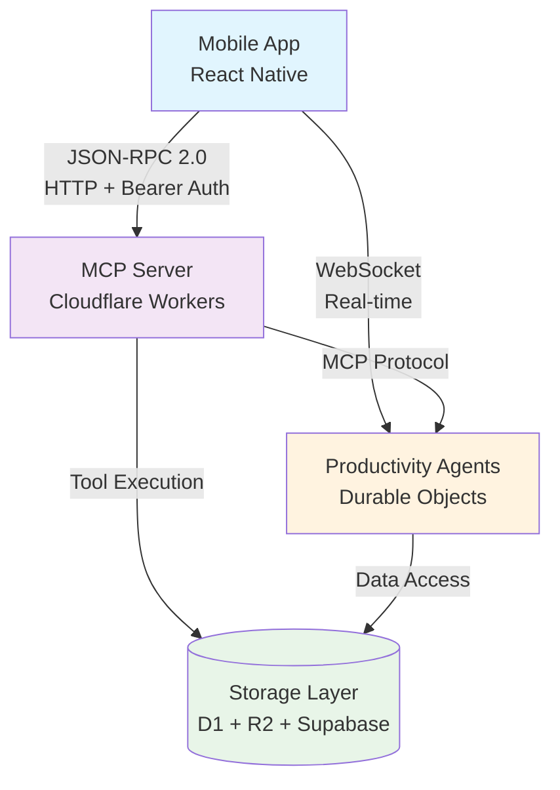
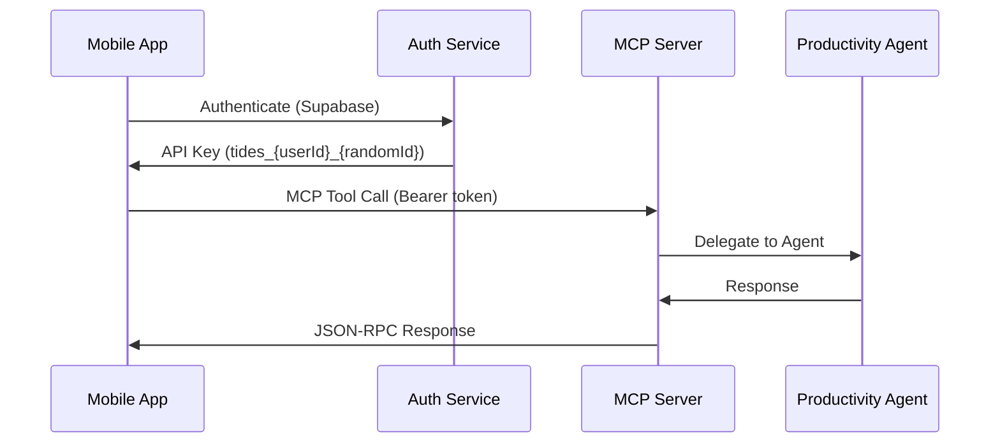
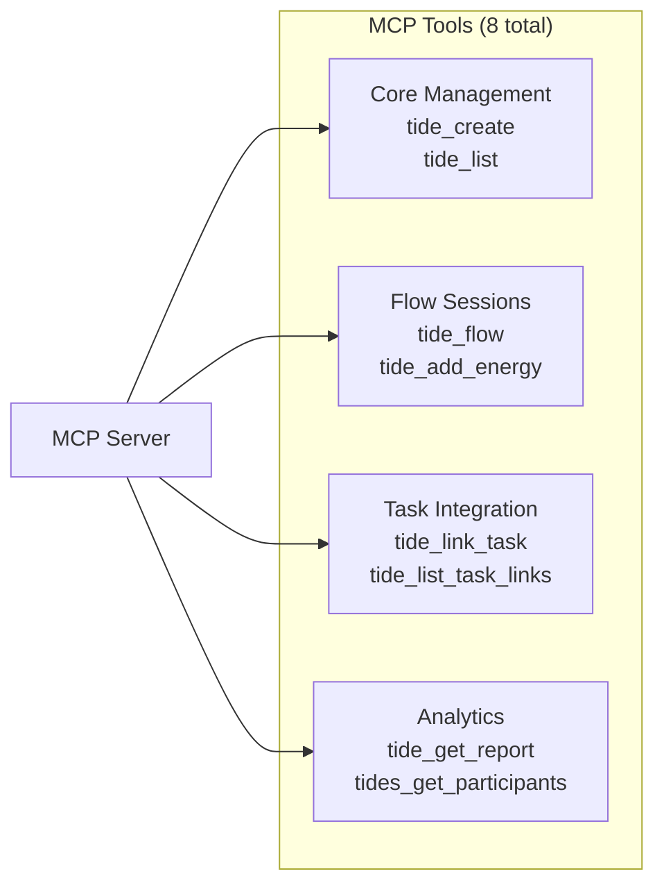
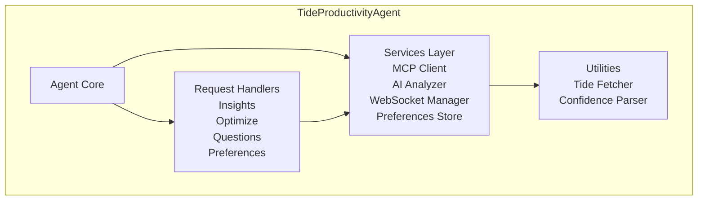
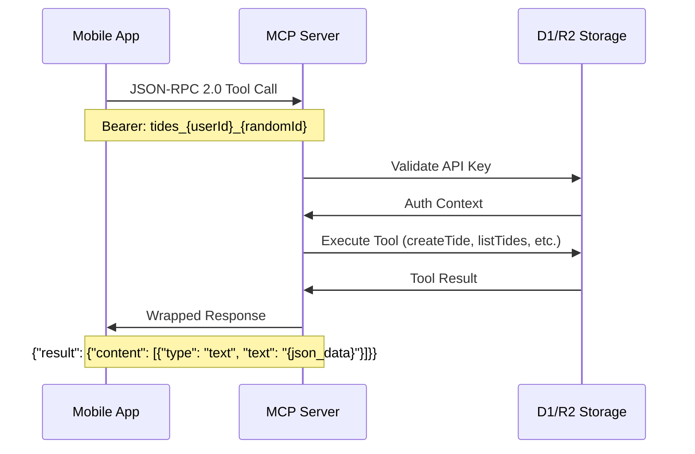
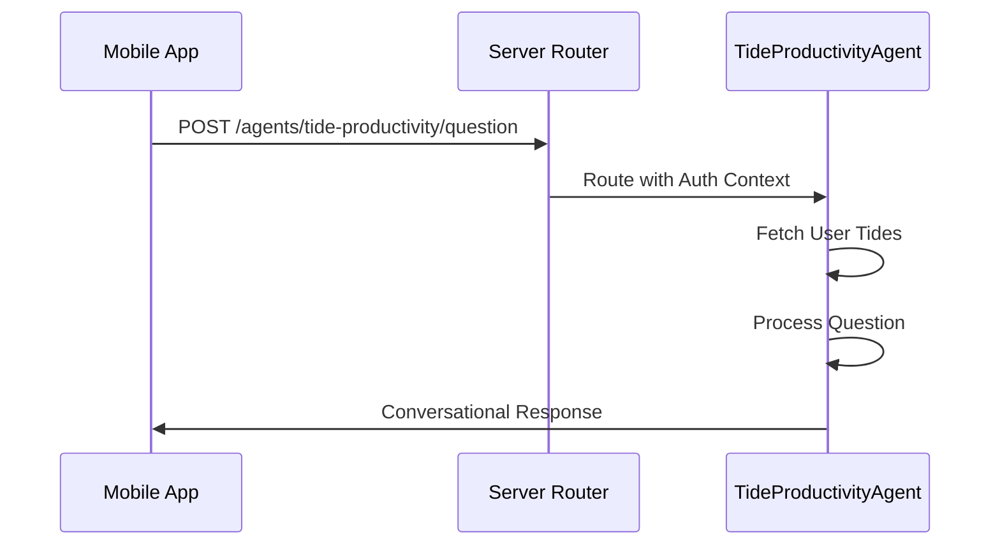
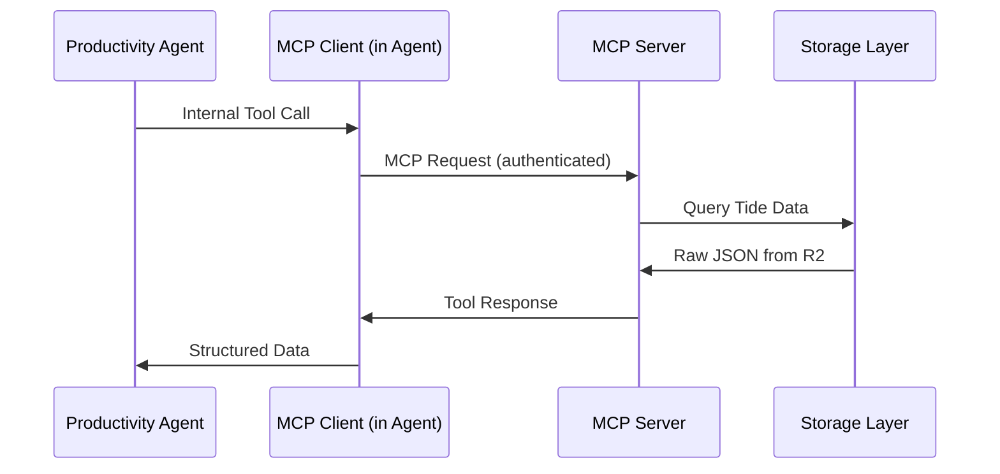
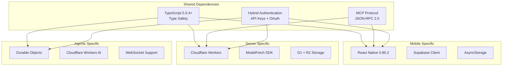
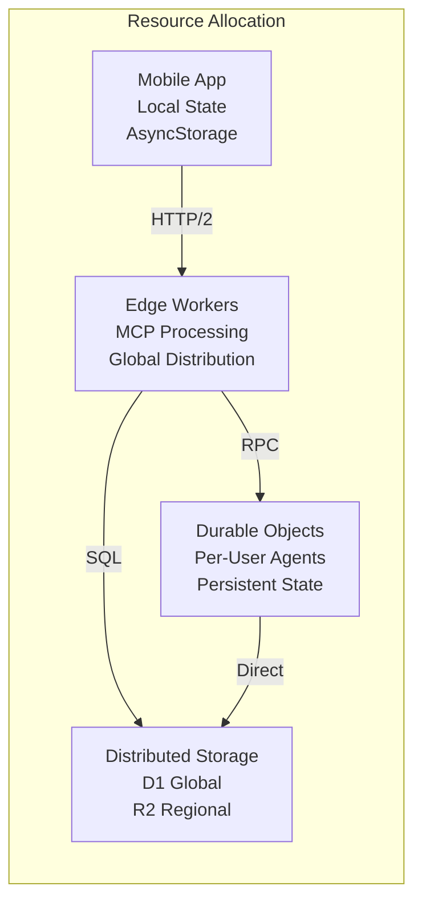

# Tides - Rythmic Workflows

## Overview

The Tides project is a sophisticated monorepo ecosystem implementing a **Model Context Protocol (MCP)** server architecture with **Cloudflare Durable Object agents** and a **React Native mobile client**. The architecture demonstrates a modern serverless pattern where mobile applications communicate with MCP servers through specialized productivity agents.

## High-Level Architecture



## Core App Relationships

### 1. **Mobile App (`apps/mobile/`)** - Client Layer

**Architecture**: React Native 0.80.2 (NO EXPO) with modular design

**Key Components**:

- **MCP Client**: JSON-RPC 2.0 communication with server
- **Authentication**: Hybrid Supabase + API key system
- **State Management**: useReducer patterns with React Context
- **Design System**: Token-based UI components

**Communication Pattern**:



### 2. **Server App (`apps/server/`)** - Protocol Layer

**Architecture**: Cloudflare Workers MCP Server with ModelFetch integration

**Key Components**:

- **MCP Server**: Core protocol implementation (`server.ts`)
- **HTTP Handler**: Request routing and CORS (`index.ts`)
- **Tool System**: 8 tide management tools organized by domain
- **Authentication**: Multi-tenant API key validation
- **Storage**: D1/R2 hybrid with JSONB optimization

**Tool Organization**:



### 3. **Agents App (`apps/agents/`)** - Intelligence Layer

**Architecture**: Cloudflare Durable Objects providing autonomous AI functionality

**Current Agents**:

#### **TideProductivityAgent**

- **Purpose**: AI-powered productivity analysis and recommendations
- **Technology**: Durable Objects + Cloudflare Workers AI
- **Features**: Energy pattern analysis, workflow optimization, team insights
- **Communication**: REST API + WebSocket for real-time updates

#### **HelloAgent** (Reference Implementation)

- **Purpose**: Demonstrates agent pattern and testing infrastructure
- **Features**: Simple greeting, visit counting, message storage
- **Communication**: REST + WebSocket

**Agent Architecture**:



## Data Flow Architecture

### Primary Communication Patterns

#### 1. **Mobile → Server (MCP Tools)**



#### 2. **Mobile → Agents (Real-time Analysis)**



#### 3. **Agent → Server (Data Access)**



## Storage Architecture

### Multi-Layer Storage Strategy

```mermaid
graph TB
    subgraph "Storage Layers"
        Supabase[(Supabase<br/>Authentication Only)]
        D1[(Cloudflare D1<br/>Metadata + API Keys)]
        R2[(Cloudflare R2<br/>Full Tide JSON)]
    end

    subgraph "Data Patterns"
        Auth[User Authentication<br/>OAuth Providers]
        Meta[Tide Metadata<br/>user_id, created_at, status]
        Full[Complete Tide Data<br/>JSONB at users/{userId}/tides/{tideId}.json]
    end

    Supabase --> Auth
    D1 --> Meta
    R2 --> Full
```

**Data Flow**:

1. **Supabase**: User authentication and initial API key generation
2. **D1**: Fast metadata queries and API key validation
3. **R2**: Complete tide data storage as JSONB files

## Authentication Architecture

### Hybrid Authentication System

```mermaid
graph LR
    subgraph "Mobile Authentication"
        User[User] --> Supabase[Supabase OAuth]
        Supabase --> APIGen[API Key Generation]
        APIGen --> Mobile[Mobile Storage<br/>tides_{userId}_{randomId}]
    end

    subgraph "Desktop Authentication"
        Desktop[Desktop Client] --> UUID[UUID Tokens<br/>{uuid}]
    end

    subgraph "Server Validation"
        Mobile --> Server[MCP Server]
        Desktop --> Server
        Server --> D1[D1 Validation]
        Server --> Fallback[Test Key Fallback<br/>testuser_001-005]
    end
```

## Technology Stack Relationships

### Core Technologies per App

| App        | Runtime             | Framework            | Protocol         | Storage      | Auth          |
| ---------- | ------------------- | -------------------- | ---------------- | ------------ | ------------- |
| **Mobile** | React Native 0.80.2 | React 19.1.0         | JSON-RPC 2.0     | AsyncStorage | Supabase      |
| **Server** | Cloudflare Workers  | ModelFetch + MCP SDK | MCP over HTTP    | D1 + R2      | Bearer Tokens |
| **Agents** | Durable Objects     | Custom Classes       | REST + WebSocket | DO Storage   | Inherited     |

### Cross-App Dependencies



## Development Patterns

### Architectural Principles

1. **Modular Design**: Each app follows single-responsibility principles
2. **Type Safety**: End-to-end TypeScript coverage (95%+)
3. **Service-Oriented**: Clean separation between services, contexts, and UI
4. **Performance Optimized**: React.memo, useCallback, and efficient state management
5. **Scalable Storage**: JSONB over enterprise complexity

### Code Organization Patterns

#### Mobile App (86% Code Reduction Achieved)

```
src/
├── components/     # Modular UI components (extracted from Home.tsx)
├── hooks/          # Custom state management hooks
├── context/        # useReducer-based state management
├── services/       # Singleton service pattern
├── design-system/  # Token-based design system
└── screens/        # Clean orchestration layers
```

#### Server App (Domain-Driven Design)

```
src/
├── handlers/       # Request handling by domain
├── tools/          # MCP tools organized by function
├── storage/        # Storage abstraction layer
├── prompts/        # AI prompt templates
└── services/       # Business logic services
```

#### Agents App (Service-Oriented Architecture)

```
agents/
├── tide-productivity-agent/
│   ├── services/   # Core business services
│   ├── handlers/   # Request/response handling
│   ├── types/      # Domain types
│   └── utils/      # Utility functions
└── hello/          # Reference implementation
```

## Performance & Scalability Considerations

### Optimization Strategies

1. **Mobile Performance**:
   - React.memo for component optimization
   - useCallback for function memoization
   - Modular architecture reduces bundle size
   - AsyncStorage for offline capability

2. **Server Scalability**:
   - Cloudflare Workers edge computing
   - D1 for fast metadata queries
   - R2 for scalable JSON storage
   - ModelFetch for efficient MCP handling

3. **Agent Efficiency**:
   - Durable Objects for persistent state
   - WebSocket for real-time communication
   - Cloudflare AI for on-edge analysis
   - Service-oriented design for modularity

### Resource Management



## Future Architecture Evolution

### Planned Enhancements

1. **Agent Ecosystem Expansion**:
   - TideAgent: Direct flow session management
   - AnalyticsAgent: Pattern aggregation
   - NotificationAgent: Smart reminders
   - CollaborationAgent: Multi-user sessions

2. **Protocol Enhancement**:
   - WebSocket MCP support for real-time updates
   - Agent-to-agent communication patterns
   - Enhanced prompt system for AI interactions

3. **Performance Optimization**:
   - Edge-optimized mobile builds
   - Advanced caching strategies
   - Predictive data loading
