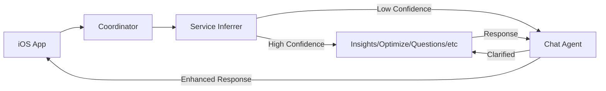

# Chat Agent Architecture Specification

## Executive Summary

This document outlines the architecture and implementation plan for adding a Chat Agent to the Tides productivity assistant. The Chat Agent will handle two critical functions:
1. **Intent Clarification**: Engage users when their requests are ambiguous (confidence < 70%)
2. **Response Enhancement**: Provide deeper follow-up analysis after sub-agent responses

## Architecture Overview

### System Context



### Key Components

1. **Chat Service** (`/services/chat.ts`)
   - Leverages Cloudflare AI Utils for LLM interactions
   - Manages conversation state
   - Generates clarification questions
   - Enhances service responses with follow-ups

2. **Enhanced Coordinator** (`/coordinator.ts`)
   - Routes to Chat Agent when confidence < 70%
   - Optionally enhances all responses with follow-up insights
   - Maintains backward compatibility with iOS client

3. **Service Inferrer Updates** (`/service-inferrer.ts`)
   - Returns confidence scores for all inferences
   - Triggers chat engagement below threshold
   - Learns from clarified intents

## Implementation Details

### 1. Chat Service Implementation

The Chat Service uses Cloudflare's `runWithTools` for embedded function calling:

```typescript
// apps/agent/src/services/chat.ts
import { runWithTools, autoTrimTools } from '@cloudflare/ai-utils';
import type { Env, ChatRequest, ChatResponse } from '../types.js';

export class ChatService {
  private env: Env;
  
  constructor(env: Env) {
    this.env = env;
  }

  async clarifyIntent(request: ChatRequest, userId: string): Promise<ChatResponse> {
    // Implementation using runWithTools
  }

  async generateFollowUp(serviceResponse: any, service: string): Promise<any> {
    // Enhancement logic
  }
}
```

### 2. Cloudflare AI Integration

We utilize Cloudflare's AI Utils library for intelligent conversation management:

- **Model**: `@hf/nousresearch/hermes-2-pro-mistral-7b` (supports function calling)
- **Tools**: Custom functions for conversation management
- **Features**: Streaming, recursive tool calls, strict validation

Reference: [Cloudflare Embedded Function Calling](https://blog.cloudflare.com/embedded-function-calling)

### 3. Conversation Flow

#### Unclear Intent Flow

```
1. User sends: "help me with my work"
2. Coordinator → Service Inferrer (confidence: 45%)
3. Coordinator → Chat Agent
4. Chat Agent returns clarification questions:
   - "Would you like insights about your productivity?"
   - "Do you need help optimizing your schedule?"
   - "Are you looking for specific productivity advice?"
5. User selects or provides clarification
6. Coordinator → Appropriate service with context
7. Service response → Optional follow-up enhancement
8. Enhanced response → User
```

#### Follow-up Enhancement Flow

```
1. Service generates response
2. Chat Agent analyzes response
3. Chat Agent adds:
   - Deeper insights
   - Follow-up questions
   - Actionable recommendations
4. Enhanced response returned to user
```

## API Specifications

### Chat Request

```typescript
interface ChatRequest extends AgentRequest {
  question?: string;
  conversation_id?: string;
  previous_context?: {
    service?: string;
    response?: any;
  };
}
```

### Chat Response

```typescript
interface ChatResponse {
  needs_clarification: boolean;
  message?: string;
  suggestions?: string[];
  conversation_id: string;
  confidence?: number;
  follow_up?: {
    insights: string[];
    questions: string[];
    recommendations: string[];
  };
}
```

## Testing Strategy

### 1. Unit Tests

```typescript
// apps/agent/src/services/__tests__/chat.test.ts
describe('ChatService', () => {
  describe('Intent Clarification', () => {
    it('should detect low confidence requests');
    it('should generate contextual clarification questions');
    it('should maintain conversation state');
  });
  
  describe('Follow-up Generation', () => {
    it('should enhance service responses with insights');
    it('should generate relevant follow-up questions');
  });
});
```

### 2. Mocked AI Utils

```typescript
// apps/agent/src/services/__mocks__/ai-utils.ts
export const runWithTools = jest.fn().mockImplementation(
  async (ai, model, config, options) => {
    // Mock responses based on input patterns
  }
);
```

### 3. Integration Tests

- Test coordinator routing to chat service
- Verify conversation state persistence
- Ensure backward compatibility
- Test error handling and timeouts

### 4. E2E Test Scenarios

1. **Unclear → Clarification → Success**
2. **Clear Intent → Direct Service → Follow-up**
3. **Multi-turn Conversation**
4. **Error Recovery**

## Conversation State Management

### Storage Strategy

Use Cloudflare Durable Objects for conversation persistence:

```typescript
// Store in Durable Object state
await this.state.storage.put(`conversation:${conversationId}`, {
  messages: [],
  context: {},
  lastUpdated: Date.now()
});
```

### State Schema

```typescript
interface ConversationState {
  id: string;
  userId: string;
  messages: Array<{
    role: 'user' | 'assistant' | 'system';
    content: string;
    timestamp: number;
  }>;
  context: {
    inferredService?: string;
    confidence?: number;
    clarificationAttempts?: number;
  };
  metadata: {
    created: number;
    lastUpdated: number;
    expiresAt: number; // Auto-cleanup after 24 hours
  };
}
```

## Performance Considerations

1. **Latency**: Target < 500ms for clarification generation
2. **Caching**: Cache common clarification patterns
3. **Streaming**: Use streaming for longer responses
4. **Timeout**: 5-second timeout for AI calls
5. **Fallback**: Default to questions service if chat fails

## Security & Privacy

1. **Conversation Isolation**: Each user's conversations are isolated
2. **Data Retention**: Auto-delete conversations after 24 hours
3. **PII Handling**: No PII stored in conversation logs
4. **Rate Limiting**: Existing rate limiter applies to chat

## Monitoring & Observability

### Metrics to Track

- Intent clarification rate (% of requests needing clarification)
- Clarification success rate (% successfully routed after clarification)
- Follow-up engagement rate
- Average confidence scores by service
- Chat service latency (P50, P95, P99)

### Logging

```typescript
console.log(`[ChatService] Intent clarification triggered - confidence: ${confidence}%`);
console.log(`[ChatService] Conversation ${conversationId} - turn ${turnCount}`);
console.log(`[ChatService] Follow-up generated for ${service} response`);
```

## Migration Plan

### Phase 1: Foundation (Week 1)
- [ ] Create chat service with basic clarification
- [ ] Update service inferrer with confidence thresholds
- [ ] Add chat to coordinator routing
- [ ] Unit tests for chat service

### Phase 2: Integration (Week 2)
- [ ] Integrate with Cloudflare AI Utils
- [ ] Implement conversation state management
- [ ] Add follow-up enhancement capability
- [ ] Integration tests

### Phase 3: Polish (Week 3)
- [ ] Optimize prompts for better clarification
- [ ] Add conversation memory and learning
- [ ] E2E tests with iOS simulator
- [ ] Performance optimization

## Dependencies

### NPM Packages

```json
{
  "@cloudflare/ai-utils": "^1.0.0"
}
```

### Cloudflare Services

- **Workers AI**: For LLM inference
- **Durable Objects**: For conversation state
- **KV**: For conversation metadata (optional)

## Reference Documentation

1. [Cloudflare Embedded Function Calling](https://blog.cloudflare.com/embedded-function-calling)
2. [Workers AI Documentation](https://developers.cloudflare.com/workers-ai/)
3. [runWithTools API Reference](https://www.npmjs.com/package/@cloudflare/ai-utils)
4. [Durable Objects Guide](https://developers.cloudflare.com/durable-objects/)
5. [Hermes-2-Pro Model](https://huggingface.co/NousResearch/Hermes-2-Pro-Mistral-7B)

## Success Criteria

1. **Reduced Failed Requests**: 50% reduction in "could not determine service" errors
2. **Improved User Experience**: 80% of unclear intents successfully clarified
3. **Response Quality**: 30% increase in user engagement with follow-ups
4. **Performance**: No degradation in response times for clear intents
5. **Backward Compatibility**: Zero breaking changes for iOS client

## Future Enhancements

1. **Multi-turn Conversations**: Support complex, multi-step queries
2. **Learning System**: Improve routing based on clarification patterns
3. **Personalization**: Adapt clarification style to user preferences
4. **Voice Integration**: Support voice-based clarification
5. **Proactive Assistance**: Suggest actions based on conversation patterns

## Appendix A: Example Conversations

### Example 1: Unclear Intent

```json
// Request
{
  "api_key": "tides_xxx",
  "question": "help me"
}

// Response (via Chat Agent)
{
  "success": true,
  "data": {
    "needs_clarification": true,
    "message": "I'd be happy to help! Could you tell me more about what you need?",
    "suggestions": [
      "View productivity insights for this week",
      "Optimize tomorrow's schedule",
      "Get tips for better focus",
      "Update my work preferences"
    ],
    "conversation_id": "conv_abc123"
  },
  "metadata": {
    "service": "chat",
    "inference": {
      "confidence": 35,
      "reasoning": "Request too general to route"
    }
  }
}
```

### Example 2: Enhanced Response

```json
// Original Service Response
{
  "productivity_score": 78,
  "trends": {
    "daily_average": 6.5,
    "improvement_areas": ["morning_focus", "task_completion"]
  }
}

// Enhanced with Follow-ups
{
  "productivity_score": 78,
  "trends": {
    "daily_average": 6.5,
    "improvement_areas": ["morning_focus", "task_completion"]
  },
  "follow_up": {
    "insights": [
      "Your productivity peaks at 2-4 PM",
      "Morning sessions show 23% more interruptions"
    ],
    "questions": [
      "Would you like tips for improving morning focus?",
      "Should we optimize your schedule around your peak hours?"
    ],
    "recommendations": [
      "Block 9-10 AM for deep work",
      "Try the Pomodoro technique for morning tasks"
    ]
  }
}
```

## Appendix B: Error Handling

### Fallback Strategy

```typescript
try {
  const clarification = await chatService.clarifyIntent(request);
  return clarification;
} catch (error) {
  console.error('[ChatService] Clarification failed:', error);
  // Fallback to questions service
  return {
    needs_clarification: false,
    suggested_service: 'questions',
    confidence: 50
  };
}
```

### Timeout Handling

```typescript
const clarificationPromise = chatService.clarifyIntent(request);
const timeoutPromise = new Promise((_, reject) => 
  setTimeout(() => reject(new Error('Clarification timeout')), 5000)
);

const result = await Promise.race([clarificationPromise, timeoutPromise]);
```

---

*Document Version: 1.0*  
*Last Updated: 2025-09-05*  
*Author: Tides Development Team*