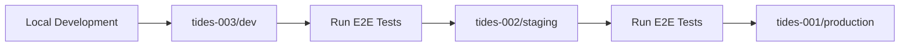

# Tides Deployment & Environment Strategy

This guide documents the Tides deployment architecture, environment naming strategy, and deployment workflows.

## Environment Naming Strategy

Tides follows an intuitive numeric ordering for environments:

| Environment     | Number    | URL                                     | Purpose                       |
| --------------- | --------- | --------------------------------------- | ----------------------------- |
| **Production**  | tides-001 | `https://tides-001.mpazbot.workers.dev` | Stable production environment |
| **Staging**     | tides-002 | `https://tides-002.mpazbot.workers.dev` | Pre-production testing        |
| **Development** | tides-003 | `https://tides-003.mpazbot.workers.dev` | Latest development features   |

### Why This Numbering?

- **001 = Production**: First priority, most stable, primary environment
- **002 = Staging**: Second tier, pre-production validation
- **003 = Development**: Third tier, experimental features

This follows common deployment patterns where lower numbers indicate higher stability and priority.

## Architecture Overview

Each environment has its own isolated resources:

- **D1 Database** (`tides-XXX-db`) - User data, tides metadata, authentication
- **R2 Bucket** (`tides-XXX-storage`) - Full JSON tide documents
- **Durable Objects** - Autonomous agents (HelloAgent, TideProductivityAgent)
- **Worker Deployment** - Separate subdomain for each environment
- **KV Namespaces** - Legacy support (3 namespaces per environment)

## MCP Endpoints

Each environment exposes the Model Context Protocol at:

| Environment | MCP Endpoint                                |
| ----------- | ------------------------------------------- |
| Production  | `https://tides-001.mpazbot.workers.dev/mcp` |
| Staging     | `https://tides-002.mpazbot.workers.dev/mcp` |
| Development | `https://tides-003.mpazbot.workers.dev/mcp` |

### Claude Desktop Configuration

For production use:

```json
{
  "mcpServers": {
    "tides": {
      "command": "npx",
      "args": ["mcp-remote", "https://tides-001.mpazbot.workers.dev/mcp"],
      "env": {
        "AUTHORIZATION": "Bearer tides_testuser_001"
      }
    }
  }
}
```

## Quick Start

### 1. Create all resources

```bash
# Run the setup script
./scripts/setup-environments.sh

# Or create resources manually:
npm run db:create:001
npm run db:create:002
npm run db:create:003
npm run kv:create:all
```

### 2. Update wrangler.toml

After creating resources, update the IDs in `wrangler.toml`:

- Replace all `PENDING_CREATION` with the actual IDs from step 1

### 3. Set API tokens

```bash
npm run secret:set:001  # Enter your Cloudflare API token
npm run secret:set:002  # Enter your Cloudflare API token
npm run secret:set:003  # Enter your Cloudflare API token
```

### 4. Initialize databases

```bash
npx wrangler d1 execute tides-001-db --file=src/db/schema.sql --env tides-001
npx wrangler d1 execute tides-002-db --file=src/db/schema.sql --env tides-002
npx wrangler d1 execute tides-003-db --file=src/db/schema.sql --env tides-003
```

### 5. Deploy

```bash
npm run deploy:prod     # Deploy to tides-001 (production)
npm run deploy:staging  # Deploy to tides-002 (staging)
npm run deploy:dev      # Deploy to tides-003 (development)
```

## Available Scripts

### Development

- `npm run dev:prod` - Run local dev server with tides-001 (production) config
- `npm run dev:staging` - Run local dev server with tides-002 (staging) config
- `npm run dev:dev` - Run local dev server with tides-003 (development) config

### Deployment

- `npm run deploy:prod` - Deploy to tides-001 (production)
- `npm run deploy:staging` - Deploy to tides-002 (staging)
- `npm run deploy:dev` - Deploy to tides-003 (development)

### Resource Management

- `npm run db:create:001/002/003` - Create D1 databases
- `npm run kv:create:001/002/003` - Create KV namespaces
- `npm run secret:set:001/002/003` - Set Cloudflare API tokens

## Environment Variables

Each environment has:

- `ENVIRONMENT` - Set to "development", "staging", or "production"
- `CLOUDFLARE_ACCOUNT_ID` - Your Cloudflare account ID
- `R2_BUCKET_NAME` - Environment-specific bucket (tides-001-storage, etc.)
- `CLOUDFLARE_API_TOKEN` - Set as a secret, not in wrangler.toml

## Database Migrations

When you update the schema, apply to all environments:

```bash
# Create migration file
echo "ALTER TABLE ..." > src/db/migration-002.sql

# Apply to all environments
npx wrangler d1 execute tides-001-db --file=src/db/migration-002.sql --env tides-001
npx wrangler d1 execute tides-002-db --file=src/db/migration-002.sql --env tides-002
npx wrangler d1 execute tides-003-db --file=src/db/migration-002.sql --env tides-003
```

## Deployment Workflow

### Standard Deployment Process



1. **Develop locally** using `npm run dev`
2. **Deploy to development** (tides-003): `npm run deploy:dev`
3. **Run E2E tests**: `npm run test:e2e`
4. **Deploy to staging** (tides-002): `npm run deploy:staging`
5. **Validate in staging** with E2E tests
6. **Deploy to production** (tides-001): `npm run deploy:prod`

### Quick Deployment Commands

```bash
# Full deployment cycle
npm run deploy:dev && npm run test:e2e
npm run deploy:staging && npm run test:e2e
npm run deploy:prod

# Check all environments health
npm run test:e2e
```

## Best Practices

1. **Always test in development (tides-003)** first
2. **Validate in staging (tides-002)** before production
3. **Deploy to production (tides-001)** only after staging validation
4. **Keep schemas synchronized** across all environments
5. **Use environment-specific API keys** for security isolation
6. **Run E2E tests** after each deployment
7. **Monitor logs** with `npm run monitor:live`

## Troubleshooting

### "PENDING_CREATION" errors

- Make sure you've run the setup script and updated wrangler.toml with actual IDs

### Database not found

- Ensure D1 database is created: `npm run db:create:001`
- Check the database ID matches in wrangler.toml

### KV namespace errors

- Create KV namespaces: `npm run kv:create:001`
- Update the namespace IDs in wrangler.toml

### API token issues

- Set the secret: `npm run secret:set:001`
- Ensure the token has necessary permissions for D1, KV, and R2
