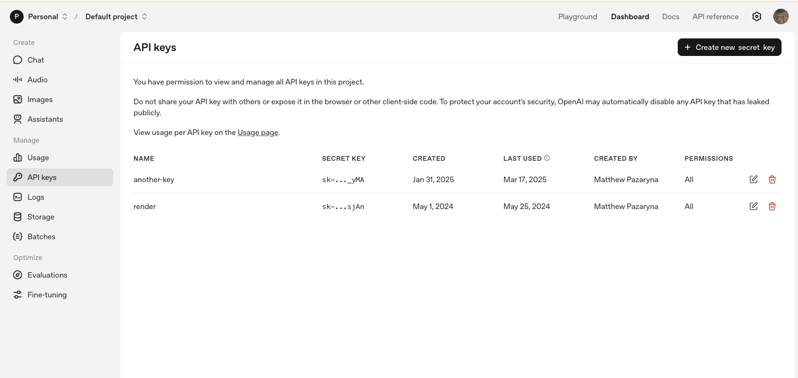
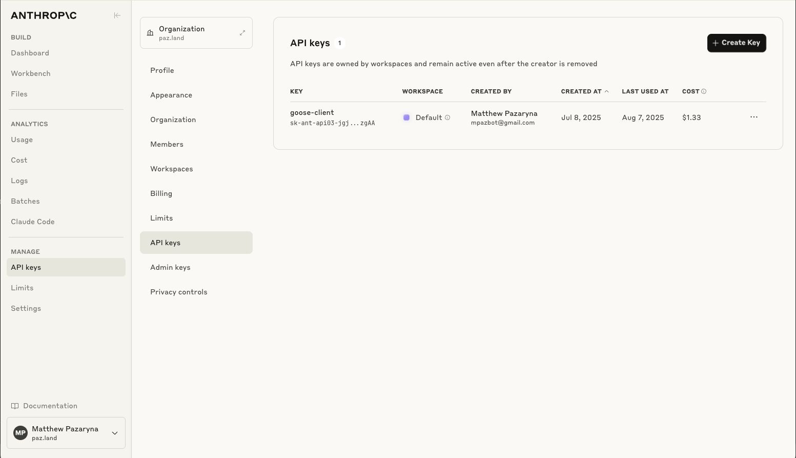
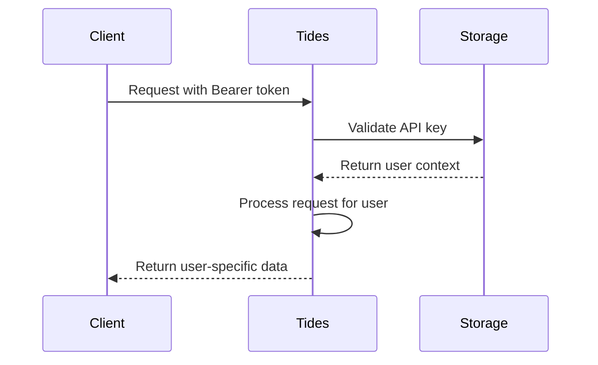

# Tides Authentication Overview

## Introduction

Tides uses Bearer token authentication following industry-standard patterns used by major AI providers like OpenAI and Anthropic. This guide explains the authentication system and provides examples from similar services.

## Industry Standard: Bearer Token Authentication

### How Major AI Services Handle API Keys

Bearer token authentication is the standard approach used by AI services:

#### OpenAI API Keys


OpenAI's approach:
- API keys start with `sk-` prefix
- Used in `Authorization: Bearer sk-...` headers
- Project-scoped with usage tracking
- Revocable and replaceable

#### Anthropic (Claude) API Keys


Anthropic's approach:
- API keys start with `sk-ant-` prefix
- Used in `Authorization: Bearer sk-ant-...` headers
- Organization-scoped with rate limiting
- Fine-grained permissions

### Tides Authentication Pattern

Tides follows the same industry pattern with some adaptations for MCP protocol:

```typescript
// Tides API key format
'tides_testuser_001'  // Development
'tides_{userId}_{keyId}'  // Production format

// Usage in requests
Authorization: Bearer tides_testuser_001
```

## Authentication Architecture

### Core Security Principles

1. **Bearer Token Required**: Every request must include a valid Bearer token
2. **No Fallbacks**: No alternative authentication methods (no x-user-id headers)
3. **User Isolation**: Each API key maps to a specific user with isolated data
4. **Stateless**: No session management - each request authenticated independently

### Authentication Flow



### Token Validation Process

1. **Extract Token**: Parse `Authorization: Bearer {token}` header
2. **Validate Format**: Check token matches expected pattern
3. **Lookup User**: Map token to userId in storage
4. **Return Context**: Provide user context for request processing

## Client Integration Examples

### MCP Protocol (Standard)

```typescript
// JSON-RPC 2.0 request to /mcp endpoint
const response = await fetch('https://tides-001.mpazbot.workers.dev/mcp', {
  method: 'POST',
  headers: {
    'Authorization': 'Bearer tides_testuser_001',
    'Content-Type': 'application/json'
  },
  body: JSON.stringify({
    jsonrpc: '2.0',
    method: 'tools/call',
    params: {
      name: 'tide_list',
      arguments: { limit: 10 }
    },
    id: 1
  })
});
```

### React Native Integration

```typescript
// AsyncStorage for token management
import AsyncStorage from '@react-native-async-storage/async-storage';

const apiKey = await AsyncStorage.getItem('tides_api_key');

const callMCPTool = async (toolName, params) => {
  const response = await fetch(baseUrl + '/mcp', {
    method: 'POST',
    headers: {
      'Authorization': `Bearer ${apiKey}`,
      'Content-Type': 'application/json'
    },
    body: JSON.stringify({
      jsonrpc: '2.0',
      method: 'tools/call',
      params: { name: toolName, arguments: params },
      id: Date.now()
    })
  });
  
  if (response.status === 401) {
    throw new Error('Invalid API key - please re-authenticate');
  }
  
  return response.json();
};
```

### curl Examples

```bash
# List tides
curl -X POST https://tides-003.mpazbot.workers.dev/mcp \
  -H 'Authorization: Bearer tides_testuser_001' \
  -H 'Content-Type: application/json' \
  -d '{
    "jsonrpc": "2.0",
    "method": "tools/call",
    "params": {
      "name": "tide_list",
      "arguments": {"limit": 5}
    },
    "id": 1
  }'

# Validate API key
curl -X POST https://tides-003.mpazbot.workers.dev/mcp \
  -H 'Authorization: Bearer tides_testuser_001' \
  -H 'Content-Type: application/json' \
  -d '{
    "jsonrpc": "2.0",
    "method": "tools/call",
    "params": {
      "name": "auth_validate_key",
      "arguments": {"api_key": "tides_testuser_001"}
    },
    "id": 1
  }'
```

## Development vs Production

### Development Tokens

For development and testing, Tides uses a simple format:

```typescript
// Valid development tokens (src/auth/index.ts)
const DEV_TOKENS = [
  'tides_testuser_001', // Maps to testuser001
  'tides_testuser_002', // Maps to testuser002
  'tides_testuser_003', // Maps to testuser003
  'tides_testuser_004', // Maps to testuser004
  'tides_testuser_005'  // Maps to testuser005
];
```

### Production Tokens

In production, tokens would follow a more secure pattern:

```typescript
// Production format (future)
'tides_{userId}_{randomKeyId}'
// Example: tides_alice_8f3k9s2d

// Would be stored in D1 database with:
{
  apiKey: 'tides_alice_8f3k9s2d',
  userId: 'alice',
  keyName: 'Mobile App Key',
  permissions: ['read', 'write'],
  createdAt: '2025-08-08T12:00:00Z',
  lastUsed: '2025-08-08T15:30:00Z'
}
```

## Error Handling

### 401 Unauthorized Responses

When authentication fails, Tides returns consistent error responses:

```json
{
  "error": "Authentication required",
  "message": "Please provide a valid Bearer token in the Authorization header"
}
```

```json
{
  "error": "Invalid API key", 
  "message": "The provided API key is invalid or expired"
}
```

### Client Error Handling

```typescript
try {
  const result = await callMCPTool('tide_list', {});
} catch (error) {
  if (error.message.includes('Invalid API key')) {
    // Redirect to login/re-authentication
    await redirectToAuth();
  } else {
    // Handle other errors
    console.error('Request failed:', error);
  }
}
```

## Security Best Practices

### For API Key Management

1. **Never hardcode keys** in client applications
2. **Use secure storage** (Keychain/Keystore on mobile)
3. **Implement key rotation** for production applications
4. **Monitor usage patterns** for suspicious activity
5. **Revoke compromised keys** immediately

### For Development

1. **Use test keys only** in development environments
2. **Don't commit keys** to version control
3. **Separate dev/staging/prod** keys and environments
4. **Log authentication events** for debugging

## Comparison with Other Services

| Service | Token Format | Header | User Mapping |
|---------|-------------|---------|-------------|
| OpenAI | `sk-...` | `Authorization: Bearer sk-...` | Project-based |
| Anthropic | `sk-ant-...` | `Authorization: Bearer sk-ant-...` | Org-based |
| **Tides** | `tides_user_id` | `Authorization: Bearer tides_user_id` | User-based |

### Why Tides Uses This Pattern

- **Consistency**: Follows established industry standards
- **Simplicity**: Easy to understand and implement
- **MCP Compatible**: Works with all MCP clients out of the box
- **Scalable**: Can evolve to more complex production patterns

## Environment-Specific Authentication

### Development
- URL: `https://tides-003.mpazbot.workers.dev`
- Token: `tides_testuser_001`
- Purpose: Testing and development

### Staging  
- URL: `https://tides-002.mpazbot.workers.dev`
- Token: Same development tokens
- Purpose: Pre-production testing

### Production
- URL: `https://tides-001.mpazbot.workers.dev`  
- Token: Production API keys (when implemented)
- Purpose: Live applications

## Related Documentation

- **[React Native Authentication Guide](./auth-react-native.md)** - Detailed React Native integration
- **[MCP Client Setup](./assets/postman-auth.png)** - Postman authentication example  
- **[Goose Integration](./assets/goose-auth.png)** - Goose AI client setup
- **[Environments and Testing](./environments-and-testing.md)** - Development setup and test accounts

## References

- **Implementation**: `src/auth/index.ts` - Token validation logic
- **Server Integration**: `src/index.ts:74-98` - Authentication middleware
- **Test Examples**: `tests/e2e/auth-check.test.ts` - Authentication test cases
- **MCP Tools**: `src/handlers/auth.ts` - API key validation tools

---

*This authentication system ensures secure, scalable access to Tides while maintaining compatibility with industry-standard MCP clients and AI development tools.*