# 🏝️ The Krusty Krab's Service & Context Ecosystem

Down in Bikini Bottom's Tides mobile app, we have a delightful bunch of sea creatures all working together to catch as many Krabby Patties (data flows) as possible! Here's how our underwater friends interact:

## 🍔 The Architecture Diagram

```mermaid
graph TD
    %% The Krusty Krab's Service & Context Ecosystem

    subgraph "🏰 Bikini Bottom Royal Court (Contexts)"
        AuthContext["👑 AuthContext<br/>(King Neptune)<br/>🔱 Rules authentication<br/>📜 useReducer patterns"]
        MCPContext["🌊 MCPContext<br/>(Sandy Cheeks)<br/>🔬 Scientific tide experiments<br/>🏗️ Orchestrates MCP operations"]
        ChatContext["🗣️ ChatContext<br/>(Patrick Star)<br/>💬 Communication hub<br/>⚡ Slash commands & tool routing"]
        ServerEnvContext["🏢 ServerEnvironmentContext<br/>(Plankton)<br/>🌐 Controls server environments<br/>🔄 Switches configurations"]
    end

    subgraph "🍔 The Krusty Krab Services (Workers)"
        authService["🦀 authService<br/>(Mr. Krabs)<br/>💰 Guards API keys & UUIDs<br/>🔐 Supabase authentication<br/>'ME MONEY!'"]
        mcpService["🧽 mcpService<br/>(SpongeBob)<br/>🍳 JSON-RPC 2.0 chef<br/>🌊 Creates tides & flows<br/>'I'm ready!'"]
        agentService["🐙 agentService<br/>(Squidward)<br/>🎨 AI conversation artist<br/>💭 Productivity insights<br/>'Why me?'"]
        loggingService["📝 loggingService<br/>(Gary)<br/>🐌 Silent observer<br/>📊 Records everything<br/>'Meow'"]
    end

    %% The Royal Dependencies (Context → Service)
    AuthContext -->|"👑 Commands for auth state"| authService
    MCPContext -->|"🔬 Experiments with"| mcpService
    ChatContext -->|"💬 Conducts conversations via"| agentService
    MCPContext -->|"🌊 Also uses for tide creation"| mcpService
    ChatContext -->|"⚡ Routes tool calls through"| mcpService
    ChatContext -->|"🤖 Provides MCP tool executor to"| agentService

    %% The Money Flow (Service → Service)
    mcpService -->|"💰 'Mr. Krabs, I need API keys!'"| authService
    agentService -->|"🎨 'Ugh, fine, give me tokens'"| authService
    ServerEnvContext -->|"🌐 'Use THIS server URL!'"| authService
    ServerEnvContext -->|"🔄 'SpongeBob, use THIS server!'"| mcpService

    %% The Gossip Network (Everyone → Gary)
    authService -->|"📢 'I authenticated someone!'"| loggingService
    mcpService -->|"🍳 'I'm making tide burgers!'"| loggingService
    agentService -->|"😒 'Another conversation...'"| loggingService
    AuthContext -->|"👑 'Royal decree logged'"| loggingService
    MCPContext -->|"🔬 'Experiment results'"| loggingService
    ChatContext -->|"💬 'Message processed'"| loggingService
    ServerEnvContext -->|"🌐 'Environment switched'"| loggingService

    %% The Context Coordination (Context → Context)
    AuthContext -->|"👑 'User is authenticated!'"| MCPContext
    AuthContext -->|"🔱 'Royal approval granted'"| ChatContext
    ServerEnvContext -->|"🌐 'New server environment!'"| MCPContext
    MCPContext -->|"🌊 'MCP connection status'"| ChatContext

    %% URL Provider Chain
    ServerEnvContext -->|"🌐 'Here's the server URL'"| authService
    ServerEnvContext -->|"📡 URL provider function"| agentService
    ServerEnvContext -->|"🌊 URL provider function"| mcpService

    %% The Krabby Patty Flow
    classDef royalContext fill:#FFD700,stroke:#FF6B35,stroke-width:3px,color:#000
    classDef service fill:#87CEEB,stroke:#4682B4,stroke-width:2px,color:#000
    classDef krabs fill:#FF6B6B,stroke:#C0392B,stroke-width:2px,color:#fff
    classDef spongebob fill:#FFFF99,stroke:#F39C12,stroke-width:2px,color:#000
    classDef squidward fill:#98FB98,stroke:#27AE60,stroke-width:2px,color:#000
    classDef gary fill:#DDA0DD,stroke:#8E44AD,stroke-width:2px,color:#000

    class AuthContext,MCPContext,ChatContext,ServerEnvContext royalContext
    class authService krabs
    class mcpService spongebob
    class agentService squidward
    class loggingService gary
```

## 🌊 The Services Squadron

### 🦀 **authService (Mr. Krabs)**
The money-obsessed manager who guards all the precious API keys and user credentials. He's always counting his UUID tokens and shouting "ME AUTHENTICATION KEYS!" while managing Supabase sessions. Other services constantly ask him for permission slips (API keys) before they can do anything.

**Key Responsibilities:**
- 💰 Guards UUID authentication tokens
- 🔐 Manages Supabase authentication
- 📱 Handles sign-in/sign-up flows
- 🔑 Provides API keys to other services

### 🧽 **mcpService (SpongeBob)**
The overly enthusiastic fry cook who's READY to make JSON-RPC 2.0 requests all day long! He talks non-stop to the MCP server, creating tides and managing flows. He relies on Mr. Krabs (authService) for API keys and now listens to Plankton (ServerEnvironmentContext) for server URL changes. Has retry logic because he sometimes drops the spatula (network errors).

**Key Responsibilities:**
- 🍳 Executes MCP tool calls via JSON-RPC 2.0
- 🌊 Creates and manages tide workflows
- ⚡ Handles flow sessions and energy tracking
- 🔄 Implements retry logic for network resilience
- 📡 Dynamically updates server URLs from environment changes

### 🐙 **agentService (Squidward)**
The grumpy but sophisticated artist who handles all the AI conversations. He's constantly complaining about having to talk to users but secretly does amazing work with productivity insights and flow suggestions. He depends on Mr. Krabs for authentication, gets server URLs from environment contexts, and can now execute MCP tools directly through ChatContext!

**Key Responsibilities:**
- 🎨 Processes AI conversations and insights
- 💭 Provides productivity analysis
- 🔮 Generates flow suggestions
- 📊 Maintains conversation context
- 🔧 Can execute MCP tools directly when needed

### 📝 **loggingService (Gary)**
The quiet pet snail who just goes "meow" but secretly records everything happening in the restaurant. Every other service tells Gary what they're doing through his simple but effective logging methods.

**Key Responsibilities:**
- 🐌 Silent but comprehensive logging
- 📊 Records all service activities
- 🔍 Provides debugging information
- 📝 Maintains system audit trail

## 🏰 The Context Commanders

### 👑 **AuthContext (King Neptune)**
The powerful ocean ruler who controls user authentication state across the entire kingdom. Everyone bows to his authority. He uses Mr. Krabs (authService) as his treasurer and maintains the royal authentication state with useReducer patterns.

**Key Responsibilities:**
- 🔱 Manages global authentication state
- 👤 Provides user session management
- 📜 Implements useReducer patterns
- 🏛️ Coordinates with other contexts

### 🌊 **MCPContext (Sandy Cheeks)**
The brilliant scientist from Texas who orchestrates all the complex MCP operations underwater in her dome. She coordinates with King Neptune for auth, uses SpongeBob for MCP calls, and manages the entire tide ecosystem. She's always experimenting with new tide flows!

**Key Responsibilities:**
- 🔬 Orchestrates MCP operations
- 🌊 Manages tide lifecycle
- ⚗️ Coordinates tool execution
- 🏗️ Maintains connection state

### 🗣️ **ChatContext (Patrick Star)**
Surprisingly the communication hub despite being... well, Patrick. He manages all conversations, tool executions, and slash commands. He depends on Sandy for MCP operations and SpongeBob for actual tool calls, while somehow making it all work in his simple Patrick way.

**Key Responsibilities:**
- 💬 Manages chat conversations
- ⚡ Routes slash commands
- 🔧 Coordinates tool execution
- 🎭 Handles AI agent interactions

### 🏢 **ServerEnvironmentContext (Plankton)**
The tiny but mighty schemer who controls which server environment everyone uses. Despite his size, he has the power to switch entire server configurations and make everyone dance to his environment changes. He secretly configures Mr. Krabs with new URLs.

**Key Responsibilities:**
- 🌐 Controls server environment switching
- 🔄 Manages configuration changes
- 📡 Provides URL routing
- ⚙️ Coordinates environment updates

## 🍔 The Krabby Patty Recipe for Success

1. **King Neptune** (AuthContext) declares: *"Let them eat Krabby Patties!"*
2. **Mr. Krabs** (authService) counts his money: *"That'll be $1 for the API key!"*
3. **Plankton** (ServerEnvironmentContext) schemes: *"Now use MY server environment!"*
4. **Sandy** (MCPContext) experiments: *"Well, I'll be! These tide flows are fascinatin'!"*
5. **SpongeBob** (mcpService) flips patties: *"I'm ready to make JSON-RPC calls!"*
6. **Patrick** (ChatContext) somehow manages communication: *"Is mayonnaise an instrument... for routing messages?"*
7. **Squidward** (agentService) reluctantly helps: *"Why do I have to provide AI insights?"*
8. **Gary** (loggingService) observes silently: *"Meow."*

## 🕸️ The Dependency Web

### Context → Service Dependencies
- **AuthContext** feeds **authService** → Everyone needs the king's approval!
- **MCPContext** orchestrates **mcpService** while watching **AuthContext**
- **ChatContext** conducts the whole orchestra, using **MCPContext** and **agentService**
- **ChatContext** gives **agentService** the power to execute MCP tools directly!

### Service → Service Dependencies
- **mcpService** + **agentService** both eat from **authService**'s API key pantry
- **ServerEnvironmentContext** secretly controls where **authService** AND **mcpService** point
- **agentService** can now call **mcpService** functionality through ChatContext

### The Gossip Network
- **loggingService** is Gary - everyone tells him their secrets

## 🏝️ Conclusion

They're all swimming around in perfect harmony, each trying to catch the most Krabby Patties (successful operations) while avoiding the Flying Dutchman (network errors) and sharing their bounty with the whole Bikini Bottom community!

*"I'm ready, I'm ready, I'm ready... to process your tide management requests!"* - SpongeBob (mcpService)

---

*"And that's how we serve up the finest Krabby Patty data flows in all of Bikini Bottom!"* 🏝️🍔