# Mobile App MCP Authentication Flow

This document describes the complete authentication flow between the Tides mobile app and the MCP server, including hybrid authentication patterns and session management.

## Overview

The mobile app uses a hybrid authentication system that supports:

- **Mobile clients**: Custom API keys generated from Supabase user authentication
- **Test users**: Hardcoded development keys for testing multi-user scenarios
- **Environment switching**: Dynamic server URL configuration with persistence

## Authentication Flow Diagram

```mermaid
sequenceDiagram
    participant User as 📱 User
    participant App as Mobile App
    participant Auth as AuthService
    participant Supabase as Supabase Auth
    participant Storage as Secure Storage
    participant MCP as MCPService
    participant Server as MCP Server
    participant ServerAuth as Server Auth Module

    Note over User, ServerAuth: Mobile App Authentication Flow with MCP Server

    %% Initial Setup
    User->>App: Launch App
    App->>Auth: Initialize AuthService
    Auth->>Storage: Load saved server URL
    Storage-->>Auth: Return saved URL or use default

    %% User Authentication
    User->>App: Enter credentials (email/password)
    App->>Auth: signInWithEmail(credentials)
    Auth->>Supabase: signInWithPassword()
    Supabase-->>Auth: Return { user, session }

    %% API Key Generation
    Note over Auth, Storage: Generate MCP API Key
    Auth->>Auth: generateApiKey(userId)
    Note right of Auth: Format: tides_{userId}_{randomId}
    Auth->>Storage: Store API key securely
    Auth-->>App: Return auth success

    %% MCP Connection Setup
    App->>MCP: getConnectionStatus()
    MCP->>Auth: getApiKey()
    Auth->>Storage: Retrieve stored API key
    Storage-->>Auth: Return API key
    Auth-->>MCP: Return API key

    %% Server Communication
    MCP->>MCP: Add auth headers
    Note right of MCP: Authorization: Bearer tides_{userId}_{randomId}
    MCP->>Server: HTTP Request with auth header

    %% Server-side Authentication
    Server->>ServerAuth: authenticate(request)
    ServerAuth->>ServerAuth: Extract Authorization header
    ServerAuth->>ServerAuth: validateApiKey(token)

    Note over ServerAuth: API Key Validation Logic
    ServerAuth->>ServerAuth: Check format: "tides_*"
    ServerAuth->>ServerAuth: Split by underscore

    alt Legacy Test User Format (tides_testuser_001-005)
        ServerAuth->>ServerAuth: Validate test user format
        Note right of ServerAuth: Maps to testuser001-005
    else Mobile Format (tides_userId_randomId)
        ServerAuth->>ServerAuth: Validate mobile format
        ServerAuth->>ServerAuth: Extract userId from parts[1]
        Note right of ServerAuth: Email: userId@mobile.tides.app
    end

    ServerAuth-->>Server: Return AuthContext or null

    alt Valid Authentication
        Server-->>MCP: Return successful response
        MCP-->>App: Connection established
        App->>User: Show authenticated interface
    else Invalid Authentication
        Server-->>MCP: Return 401 Unauthorized
        MCP-->>App: Connection failed
        App->>User: Show authentication error
    end

    %% Environment Switching
    Note over User, Server: Server Environment Selection
    User->>App: Select different server environment
    App->>Auth: setWorkerUrl(newUrl)
    Auth->>Storage: Save new server URL
    App->>MCP: updateServerUrl(newUrl)
    MCP->>Server: Subsequent requests to new URL

    %% API Key Refresh
    Note over User, Storage: API Key Management
    User->>App: Trigger API key refresh
    App->>Auth: refreshApiKey()
    Auth->>Auth: generateApiKey(userId)
    Auth->>Storage: Store new API key
    Auth-->>App: API key refreshed

    %% Session Management
    Note over Supabase, App: Session Persistence
    Supabase->>App: Auth state change event
    App->>Auth: onAuthStateChange callback
    alt User Signs Out
        Auth->>Storage: Remove API key
        Auth->>Supabase: signOut()
        App->>User: Return to login screen
    else Session Expires
        Auth->>Storage: Remove API key
        App->>User: Show re-authentication prompt
    end
```



## Architecture Components

### Mobile App Components

#### AuthService (`apps/mobile/src/services/authService.ts`)

- **Purpose**: Manages Supabase authentication and MCP API key generation
- **Key Methods**:
  - `signInWithEmail()` - Supabase authentication
  - `generateApiKey()` - Creates `tides_{userId}_{randomId}` format
  - `getApiKey()` - Retrieves stored API key
  - `setWorkerUrl()` - Updates server URL

#### MCPService (`apps/mobile/src/services/mcpService.ts`)

- **Purpose**: Handles HTTP communication with MCP server
- **Authentication**: Adds `Authorization: Bearer {apiKey}` headers
- **Base Class**: Extends `BaseService` for common HTTP functionality

#### Secure Storage

- **Purpose**: Encrypted storage for API keys and sensitive data
- **Implementation**: React Native Keychain for secure persistence
- **Keys Stored**: API keys, server URLs, session tokens

### Server Components

#### Authentication Module (`apps/server/src/auth/index.ts`)

- **Purpose**: Validates incoming API keys and creates auth context
- **Supported Formats**:
  - **Mobile**: `tides_{userId}_{randomId}` → `userId@mobile.tides.app`
  - **Test Users**: `tides_testuser_{001-005}` → `testuser{001-005}@example.com`

#### MCP Server (`apps/server/src/server.ts`)

- **Purpose**: Core MCP implementation with authentication middleware
- **Tools**: Tide management, energy tracking, task linking
- **Authentication**: Uses auth module for request validation

## API Key Formats

### Mobile Client Format

```
tides_{userId}_{randomId}
```

- **userId**: Supabase user ID (UUID format)
- **randomId**: 16-character random string
- **Example**: `tides_550e8400-e29b-41d4-a716-446655440000_aB3dE6fG8hI9jK2L`

### Test User Format

```
tides_testuser_{001-005}
```

- **Purpose**: Development and testing
- **Valid Keys**: `tides_testuser_001`, `tides_testuser_002`, `tides_testuser_003`, `tides_testuser_004`, `tides_testuser_005`
- **Mapping**: `tides_testuser_001` → `testuser001`

## Server Environment Configuration

### Available Environments

1. **env.001 (Development)**: `tides-001.mpazbot.workers.dev`
2. **env.002 (Staging)**: `tides-002.mpazbot.workers.dev`
3. **env.003 (Production)**: `tides-003.mpazbot.workers.dev`
4. **env.006 (Mason Development)**: `tides-006.mpazbot.workers.dev`
5. **Custom/Legacy**: `supabase-tides-demo-1.mason-c32.workers.dev`

### Environment Switching

- **UI**: ServerEnvironmentSelector component in mobile app
- **Persistence**: Server URL saved to AsyncStorage
- **Integration**: MCPContext automatically updates connections

## Security Considerations

### API Key Security

- **Generation**: Cryptographically secure random strings
- **Storage**: Device keychain/secure enclave
- **Transmission**: HTTPS with Bearer token authentication
- **Rotation**: Manual refresh capability

### Authentication Validation

- **Format Validation**: Strict pattern matching
- **Length Limits**: Reasonable bounds on user IDs
- **Rejection**: Invalid formats immediately rejected
- **Isolation**: User data segregated by authenticated user ID

## Error Handling

### Common Authentication Errors

- **401 Unauthorized**: Invalid or missing API key
- **403 Forbidden**: Valid key but insufficient permissions
- **Network Errors**: Handled with retry logic and user feedback

### Client-Side Error Recovery

- **Automatic Retry**: Network failures with exponential backoff
- **Key Refresh**: Manual API key regeneration
- **Re-authentication**: Prompt for login on session expiry

## Implementation Files

### Mobile App

- `apps/mobile/src/services/authService.ts` - Authentication service
- `apps/mobile/src/services/mcpService.ts` - MCP communication
- `apps/mobile/src/services/base/BaseService.ts` - HTTP base class
- `apps/mobile/src/context/AuthContext.tsx` - Authentication state management
- `apps/mobile/src/context/MCPContext.tsx` - MCP connection management

### Server

- `apps/server/src/auth/index.ts` - Authentication validation
- `apps/server/src/server.ts` - MCP server implementation
- `apps/server/src/handlers/auth.ts` - Authentication handlers

## Development and Testing

### Test Users

The server provides 5 hardcoded test users for development:

- `testuser001` - `testuser005`
- Each with corresponding API key: `tides_testuser_001` - `tides_testuser_005`
- Used for multi-user testing and data isolation verification

### Environment Testing

- **Local Development**: Use default mason-c32 environment
- **Staging**: Test with env.002 for pre-production validation
- **Production**: Deploy to env.003 for live usage
