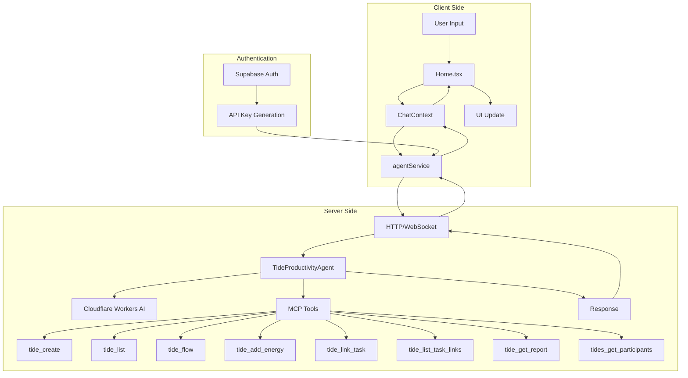

# Home.tsx Agent Communication Architecture

## 1. Communication Architecture

```
Home.tsx → ChatContext → agentService → TideProductivityAgent (Server)
    ↓           ↓            ↓                    ↓
UI Layer → State Mgmt → Service Layer → Cloudflare Durable Object
```

## 2. Key Communication Points in Home.tsx

The Home component (`apps/mobile/src/screens/Main/Home.tsx`) communicates with agents through:

### Agent Initialization (lines 187-216)

- When component mounts, it initializes the agentService with the server URL
- The service configures endpoints for both HTTP and WebSocket communication

### Message Sending (lines 241-244)

- User types `/agent [message]` to send to agent
- Calls `sendAgentMessage()` from ChatContext
- Routes through agentService to the server

### Direct Tool Execution (lines 245-259)

- User types `/tool [toolName] param=value`
- Bypasses agent, directly calls MCP tools
- Uses `executeMCPTool()` from ChatContext

## 3. Agent Service Layer

The `agentService.ts` handles:

### HTTP Communication

- Question endpoint (`/agents/tide-productivity/question`) - lines 138-219
- Insights endpoint (`/agents/tide-productivity/insights`) - lines 221-292
- Optimization endpoint (`/agents/tide-productivity/optimize`) - lines 294-372

### WebSocket Communication (lines 374-472)

- Real-time bidirectional communication
- Auto-reconnection with exponential backoff
- Message handlers for push notifications

## 4. Server-Side Agent (TideProductivityAgent)

The Cloudflare Durable Object agent:

### Architecture

- Uses MCP (Model Context Protocol) for tool access
- Integrates with Cloudflare Workers AI for intelligence
- Has access to all 8 tide management tools

### Key Capabilities

1. **Productivity Insights** - Analyzes user's tides and provides recommendations
2. **Schedule Optimization** - Suggests optimal work times based on energy patterns
3. **Question Handling** - Answers productivity questions using AI + tide data
4. **Real-time Updates** - WebSocket support for live notifications

## 5. Authentication Flow

1. User logs in via Supabase
2. AuthService generates `tides_{userId}_{randomId}` API key
3. Agent service uses this key for all requests
4. Server validates key and provides user-scoped access

## 6. MCP Tool Integration

The agent can autonomously call these tools:

- `tide_create` - Create workflows
- `tide_list` - List user's tides
- `tide_flow` - Manage flow states
- `tide_add_energy` - Track energy levels
- `tide_link_task` - Link external tasks
- `tide_list_task_links` - View task connections
- `tide_get_report` - Generate reports
- `tides_get_participants` - Get participant info

## 7. Current Implementation Status

### Working:

- Basic agent service structure
- HTTP endpoints configured
- WebSocket connection logic
- Authentication integration

### Placeholder/Not Fully Implemented:

- ChatContext's `sendAgentMessage()` currently shows "not yet implemented" (line 669)
- Agent responses are mocked in some places
- Full MCP tool execution chain needs completion

## 8. How It Should Work (When Fully Implemented)

1. User sends message → Home.tsx captures input
2. Routes through ChatContext → Manages state and conversation history
3. AgentService processes → Sends to server with auth
4. TideProductivityAgent analyzes → Uses AI + MCP tools
5. Response flows back → Through WebSocket or HTTP response
6. UI updates → Shows agent response in chat bubbles

The architecture is well-designed with proper separation of concerns, but the actual agent communication implementation appears to be in progress, with placeholders for the full integration.

## Communication Flow Diagram


