# MCP Tool Call Flow - Complete Architecture

## Overview Flow Diagram

```mermaid
graph TB
    subgraph "📱 Mobile Client (React Native)"
        User[👤 User Action]
        Agent[🤖 Agent Command]
        
        subgraph "Screens"
            HomeScreen[Home.tsx<br/>Main Dashboard]
            SettingsScreen[Settings.tsx<br/>Debug Interface]
            TideDetails[TideDetails.tsx<br/>Tide Management]
            TidesList[TidesList.tsx<br/>List View]
        end
        
        subgraph "Components"
            ChatInput[chat/ChatInput.tsx<br/>Message Input]
            ToolMenu[tools/ToolMenu.tsx<br/>Tool Selection]
            TideCard[tides/TideCard.tsx<br/>Tide Display]
            DebugPanel[debug/DebugPanel.tsx<br/>Testing Tools]
            ContextSwitcher[tides/ContextSwitcher.tsx<br/>Context Management]
            HierarchicalTidesList[tides/HierarchicalTidesList.tsx<br/>Hierarchical View]
        end
        
        subgraph "Hooks"
            useTidesManagement[useTidesManagement.ts<br/>Tide Operations]
            useMCPConnection[useMCPConnection.ts<br/>Connection Management]
            useToolMenu[useToolMenu.ts<br/>Tool State]
            useHierarchicalContext[useHierarchicalContext.ts<br/>Context Management]
            useDailyTide[useDailyTide.ts<br/>Daily Context]
            useContextTide[useContextTide.ts<br/>Context Switching]
        end
        
        subgraph "Context Layer"
            MCPContext[MCPContext.tsx<br/>MCP Tool Methods]
            ChatContext[ChatContext.tsx<br/>Agent Communication]
            AuthContext[AuthContext.tsx<br/>API Key Management]
            ServerEnvironmentContext[ServerEnvironmentContext.tsx<br/>Environment Switching]
            TimeContext[TimeContext.tsx<br/>Time Management]
        end
        
        subgraph "Service Layer"
            mcpService[mcpService.ts<br/>MCP Client Implementation]
            agentService[agentService.ts<br/>AI Agent Processing]
            authService[authService.ts<br/>Auth & API Keys]
            loggingService[loggingService.ts<br/>Centralized Logging]
            phraseDetectionService[phraseDetectionService.ts<br/>Natural Language]
        end
        
        subgraph "Types"
            MCPTypes[types/mcp.ts<br/>MCP Protocol Types]
            ChatTypes[types/chat.ts<br/>Chat Interface Types]
            ModelTypes[types/models.ts<br/>Domain Models]
            APITypes[types/api-types.ts<br/>API Response Types]
        end
    end
    
    subgraph "🌐 Network Layer"
        HTTP[HTTP Request<br/>JSON-RPC 2.0<br/>Bearer Token Auth]
    end
    
    subgraph "☁️ Cloudflare Workers Server"
        subgraph "Entry Point"
            IndexTS[index.ts<br/>HTTP Handler]
            ServerTS[server.ts<br/>MCP Server]
        end
        
        subgraph "Handler Layer"
            ToolsHandler[handlers/tools.ts<br/>MCP Tool Registration]
            AuthHandler[handlers/auth.ts<br/>Authentication]
            AIToolsHandler[handlers/ai-tools.ts<br/>AI Tool Integration]
            PromptsHandler[handlers/prompts.ts<br/>Prompt Management]
        end
        
        subgraph "Business Logic"
            TideCore[tools/tide-core.ts<br/>Core Operations]
            TideHierarchical[tools/tide-hierarchical-flow.ts<br/>Hierarchical Context]
            TideSessions[tools/tide-sessions.ts<br/>Flow Sessions]
            TideTasks[tools/tide-tasks.ts<br/>Task Links]
            TideAnalytics[tools/tide-analytics.ts<br/>Reports & Analytics]
            TideContext[tools/tide-context.ts<br/>Context Switching]
        end
        
        subgraph "Storage Layer"
            D1R2Storage[storage/d1-r2.ts<br/>Primary Storage]
            MockStorage[storage/mock.ts<br/>Testing Storage]
            R2Storage[storage/r2.ts<br/>Object Storage]
            R2RestStorage[storage/r2-rest.ts<br/>REST API Storage]
        end
        
        subgraph "Data Stores"
            CloudflareD1[(Cloudflare D1<br/>SQL Metadata)]
            CloudflareR2[(Cloudflare R2<br/>Full Tide JSON)]
        end
    end
    
    %% User/Agent Interactions
    User --> HomeScreen
    User --> TideDetails
    User --> SettingsScreen
    Agent --> ChatInput
    
    %% Component to Hook Connections
    HomeScreen --> useTidesManagement
    HomeScreen --> useHierarchicalContext
    HomeScreen --> TideCard
    ChatInput --> useToolMenu
    DebugPanel --> useMCPConnection
    ContextSwitcher --> useContextTide
    HierarchicalTidesList --> useDailyTide
    
    %% Hook to Context Connections
    useTidesManagement --> MCPContext
    useMCPConnection --> MCPContext
    useToolMenu --> MCPContext
    useHierarchicalContext --> MCPContext
    useDailyTide --> MCPContext
    useContextTide --> ServerEnvironmentContext
    
    %% Context to Service Connections
    MCPContext --> mcpService
    ChatContext --> agentService
    AuthContext --> authService
    ServerEnvironmentContext --> authService
    ChatContext --> phraseDetectionService
    TimeContext --> loggingService
    
    %% Service Layer to Network
    mcpService --> HTTP
    agentService --> HTTP
    authService --> HTTP
    loggingService -.-> HTTP
    
    %% Type Safety
    MCPTypes -.-> mcpService
    ChatTypes -.-> ChatContext
    ModelTypes -.-> MCPContext
    APITypes -.-> agentService
    
    %% Server Flow
    HTTP --> IndexTS
    IndexTS --> ServerTS
    ServerTS --> ToolsHandler
    ServerTS --> AIToolsHandler
    ServerTS --> PromptsHandler
    ToolsHandler --> TideCore
    ToolsHandler --> TideHierarchical
    ToolsHandler --> TideSessions
    ToolsHandler --> TideTasks
    ToolsHandler --> TideAnalytics
    ToolsHandler --> TideContext
    
    %% Storage Connections
    TideCore --> D1R2Storage
    TideHierarchical --> D1R2Storage
    TideSessions --> D1R2Storage
    TideTasks --> D1R2Storage
    TideAnalytics --> D1R2Storage
    TideContext --> D1R2Storage
    AIToolsHandler --> D1R2Storage
    
    %% Data Storage
    D1R2Storage --> CloudflareD1
    D1R2Storage --> CloudflareR2
    R2Storage --> CloudflareR2
    R2RestStorage --> CloudflareR2
    
    %% Authentication Flow
    AuthHandler -.-> AuthContext
    ToolsHandler --> AuthHandler
    AIToolsHandler --> AuthHandler
    PromptsHandler --> AuthHandler
    
    classDef userInterface fill:#e1f5fe
    classDef components fill:#f3e5f5
    classDef hooks fill:#e8f5e8
    classDef context fill:#fff3e0
    classDef services fill:#fce4ec
    classDef network fill:#f1f8e9
    classDef server fill:#e3f2fd
    classDef storage fill:#fff8e1
    
    class User,Agent,HomeScreen,SettingsScreen,TideDetails,TidesList userInterface
    class ChatInput,ToolMenu,TideCard,DebugPanel,ContextSwitcher,HierarchicalTidesList components
    class useTidesManagement,useMCPConnection,useToolMenu,useHierarchicalContext,useDailyTide,useContextTide hooks
    class MCPContext,ChatContext,AuthContext,ServerEnvironmentContext,TimeContext context
    class mcpService,agentService,authService,loggingService,phraseDetectionService services
    class HTTP network
    class IndexTS,ServerTS,ToolsHandler,AuthHandler,AIToolsHandler,PromptsHandler,TideCore,TideHierarchical,TideSessions,TideTasks,TideAnalytics,TideContext server
    class D1R2Storage,MockStorage,R2Storage,R2RestStorage,CloudflareD1,CloudflareR2 storage
```



## Detailed Tool Call Flow


## Authentication & Error Flow

```mermaid
flowchart TD
    subgraph "🔐 Authentication Flow"
        A1[User signs in via Supabase] --> A2[authService gets API key]
        A2 --> A3[Format: tides_userId_randomId]
        A3 --> A4[Store in secureStorage]
        A4 --> A5[AuthContext manages state]
        A5 --> A6[MCPContext loads token]
        A6 --> A7[mcpService adds Bearer header]
        A7 --> A8[ServerEnvironmentContext switches endpoints]
    end
    
    subgraph "⚠️ Error Handling"
        E1[Network Error] --> E2[mcpService.handleResponse()]
        E2 --> E3[Parse error message]
        E3 --> E4[MCPContext error state]
        E4 --> E5[UI shows error notification]
        
        E6[401 Unauthorized] --> E7[Clear invalid token]
        E7 --> E8[Redirect to auth screen]
        
        E9[Tool validation error] --> E10[Zod schema failure]
        E10 --> E11[Server returns error]
        E11 --> E12[Client shows parameter error]
    end
    
    subgraph "🔄 Retry Logic"
        R1[Request fails] --> R2[Exponential backoff]
        R2 --> R3[Retry up to 3 times]
        R3 --> R4[Final failure → user error]
    end
```

## MCP Tool Registration Details

```mermaid
graph LR
    subgraph "📋 Tool Registration Process"
        TR1[server.ts imports handlers/tools.ts] --> TR2[registerTideTools called]
        TR2 --> TR3[14 tools registered with server.registerTool]
        TR3 --> TR4[Each tool has Zod schema validation]
        TR4 --> TR5[Tools map to functions in tools/ directory]
    end
    
    subgraph "🛠️ Available Tools by Category"
        subgraph "Core Tools (9)"
            CT1[tide_create]
            CT2[tide_list]  
            CT3[tide_flow]
            CT4[tide_add_energy]
            CT5[tide_link_task]
            CT6[tide_list_task_links]
            CT7[tide_get_report]
            CT8[tide_get_raw_json]
            CT9[tides_get_participants]
        end
        
        subgraph "Hierarchical Tools (5)"
            HT1[tide_get_or_create_daily]
            HT2[tide_start_hierarchical_flow]
            HT3[tide_get_todays_summary]
            HT4[tide_list_contexts]
            HT5[tide_switch_context]
        end
    end
    
    subgraph "📱 Mobile Service Methods"
        subgraph "Core Methods (9)"
            CM1[createTide]
            CM2[listTides]
            CM3[startTideFlow]
            CM4[addEnergyToTide]
            CM5[linkTaskToTide]
            CM6[listTaskLinks]
            CM7[getTideReport]
            CM8[getRawTideJson]
            CM9[getTideParticipants]
        end
        
        subgraph "Hierarchical Methods (5)"
            HM1[getOrCreateDailyTide]
            HM2[startSmartFlow]
            HM3[getTodaysSummary]
            HM4[listContexts]
            HM5[switchContext]
        end
    end
    
    %% Map tools to methods
    CT1 -.-> CM1
    CT2 -.-> CM2
    CT3 -.-> CM3
    CT4 -.-> CM4
    CT5 -.-> CM5
    CT6 -.-> CM6
    CT7 -.-> CM7
    CT8 -.-> CM8
    CT9 -.-> CM9
    
    HT1 -.-> HM1
    HT2 -.-> HM2
    HT3 -.-> HM3
    HT4 -.-> HM4
    HT5 -.-> HM5
```



## File Dependencies Map


This comprehensive diagram shows:

1. **Complete user journey** from UI interaction to data storage
2. **All file dependencies** and their relationships
3. **Authentication and error handling** flows
4. **Tool registration** process on server side
5. **Type safety** via shared definitions
6. **Storage architecture** with Cloudflare D1/R2
7. **Hierarchical context management** with enhanced mobile components
8. **AI service integration** with natural language processing

The system demonstrates a modern React Native architecture with:

- **Modular component structure** organized by domain
- **Comprehensive hook system** for state management
- **Multi-environment support** via ServerEnvironmentContext
- **Enhanced logging and debugging** capabilities
- **AI-powered conversation interface** via ChatContext
- **Hierarchical tide management** with context switching
- **Secure authentication** with API key management
- **Type-safe MCP protocol** implementation