# Tides Architecture Analysis: Relationship Between Server, Agents, and Mobile

## Overview

The Tides project is a sophisticated monorepo ecosystem implementing a **Model Context Protocol (MCP)** server architecture with **Cloudflare Durable Object agents** and a **React Native mobile client**. The architecture demonstrates a modern serverless pattern where mobile applications communicate with MCP servers through specialized productivity agents.

## High-Level Architecture

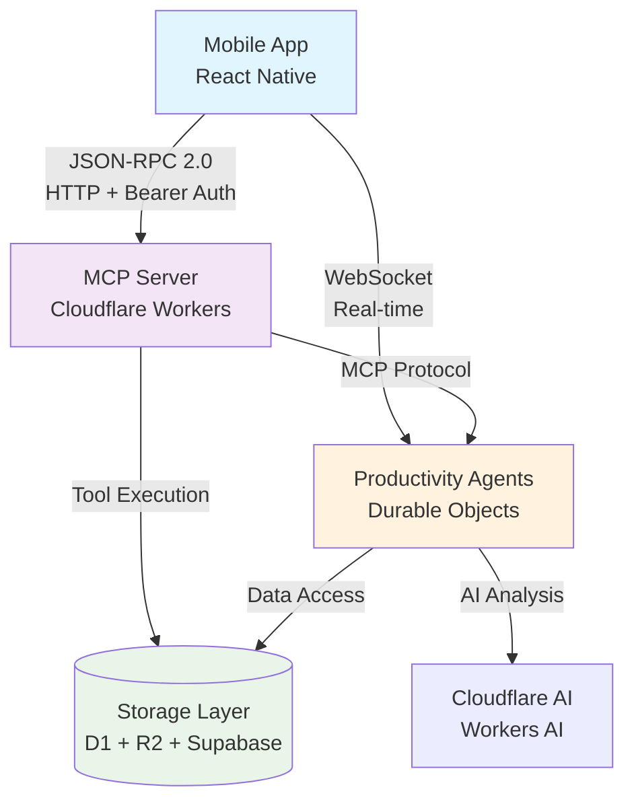

## Core App Relationships

### 1. **Mobile App (`apps/mobile/`)** - Client Layer

**Architecture**: React Native 0.80.2 (NO EXPO) with modular design

**Key Components**:

- **MCP Client**: JSON-RPC 2.0 communication with server
- **Authentication**: Hybrid Supabase + API key system
- **State Management**: useReducer patterns with React Context
- **Design System**: Token-based UI components

**Communication Pattern**:

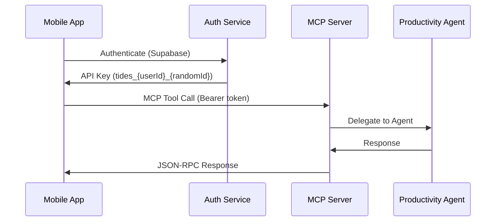

### 2. **Server App (`apps/server/`)** - Protocol Layer

**Architecture**: Cloudflare Workers MCP Server with ModelFetch integration

**Key Components**:

- **MCP Server**: Core protocol implementation (`server.ts`)
- **HTTP Handler**: Request routing and CORS (`index.ts`)
- **Tool System**: 8 tide management tools organized by domain
- **Authentication**: Multi-tenant API key validation
- **Storage**: D1/R2 hybrid with JSONB optimization

**Tool Organization**:

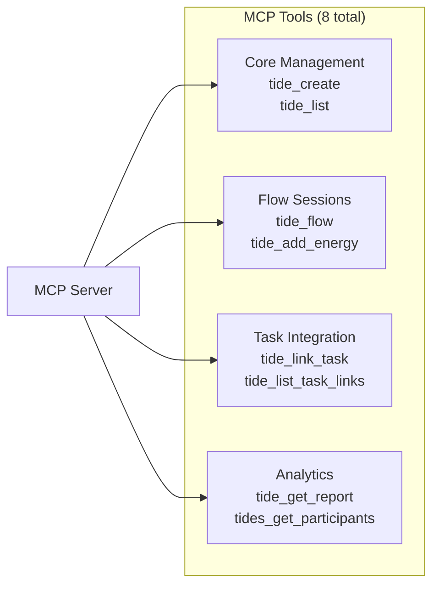

### 3. **Agents App (`apps/agents/`)** - Intelligence Layer

**Architecture**: Cloudflare Durable Objects providing autonomous AI functionality

**Current Agents**:

#### **TideProductivityAgent**

- **Purpose**: AI-powered productivity analysis and recommendations
- **Technology**: Durable Objects + Cloudflare Workers AI
- **Features**: Energy pattern analysis, workflow optimization, team insights
- **Communication**: REST API + WebSocket for real-time updates

#### **HelloAgent** (Reference Implementation)

- **Purpose**: Demonstrates agent pattern and testing infrastructure
- **Features**: Simple greeting, visit counting, message storage
- **Communication**: REST + WebSocket

**Agent Architecture**:

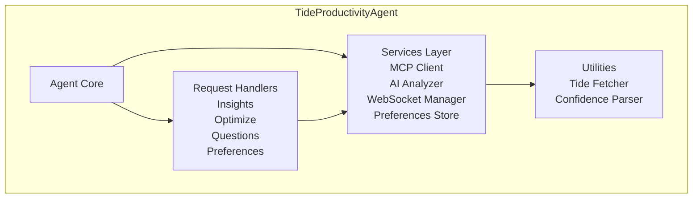

## Data Flow Architecture

### Primary Communication Patterns

#### 1. **Mobile → Server (MCP Tools)**

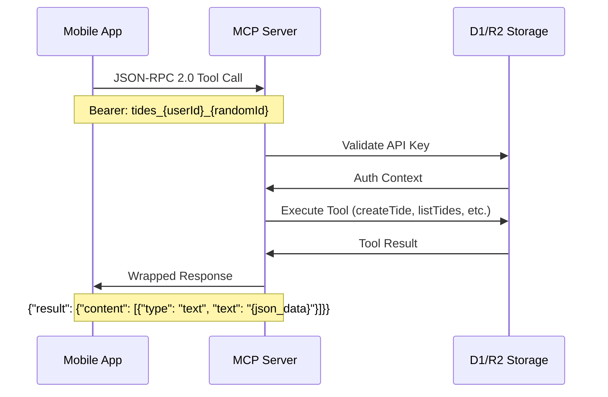

#### 2. **Mobile → Agents (Real-time Analysis)**

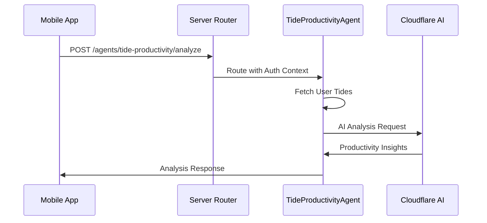

#### 3. **Agent → Server (Data Access)**

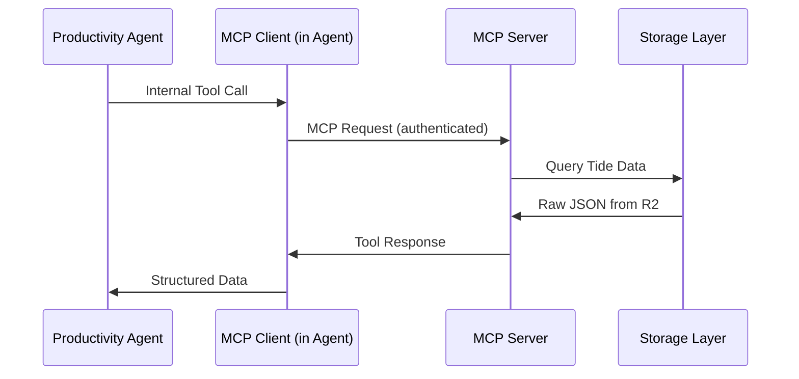

## Storage Architecture

### Multi-Layer Storage Strategy

```mermaid
graph TB
    subgraph "Storage Layers"
        Supabase[(Supabase<br/>Authentication Only)]
        D1[(Cloudflare D1<br/>Metadata + API Keys)]
        R2[(Cloudflare R2<br/>Full Tide JSON)]
    end

    subgraph "Data Patterns"
        Auth[User Authentication<br/>OAuth Providers]
        Meta[Tide Metadata<br/>user_id, created_at, status]
        Full[Complete Tide Data<br/>JSONB at users/{userId}/tides/{tideId}.json]
    end

    Supabase --> Auth
    D1 --> Meta
    R2 --> Full
```

**Data Flow**:

1. **Supabase**: User authentication and initial API key generation
2. **D1**: Fast metadata queries and API key validation
3. **R2**: Complete tide data storage as JSONB files

## Authentication Architecture

### Hybrid Authentication System

```mermaid
graph LR
    subgraph "Mobile Authentication"
        User[User] --> Supabase[Supabase OAuth]
        Supabase --> APIGen[API Key Generation]
        APIGen --> Mobile[Mobile Storage<br/>tides_{userId}_{randomId}]
    end

    subgraph "Desktop Authentication"
        Desktop[Desktop Client] --> UUID[UUID Tokens<br/>{uuid}]
    end

    subgraph "Server Validation"
        Mobile --> Server[MCP Server]
        Desktop --> Server
        Server --> D1[D1 Validation]
        Server --> Fallback[Test Key Fallback<br/>testuser_001-005]
    end
```

## Technology Stack Relationships

### Core Technologies per App

| App        | Runtime             | Framework            | Protocol         | Storage      | Auth          |
| ---------- | ------------------- | -------------------- | ---------------- | ------------ | ------------- |
| **Mobile** | React Native 0.80.2 | React 19.1.0         | JSON-RPC 2.0     | AsyncStorage | Supabase      |
| **Server** | Cloudflare Workers  | ModelFetch + MCP SDK | MCP over HTTP    | D1 + R2      | Bearer Tokens |
| **Agents** | Durable Objects     | Custom Classes       | REST + WebSocket | DO Storage   | Inherited     |

### Cross-App Dependencies

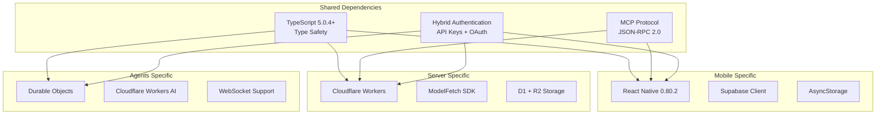

## Development Patterns

### Architectural Principles

1. **Modular Design**: Each app follows single-responsibility principles
2. **Type Safety**: End-to-end TypeScript coverage (95%+)
3. **Service-Oriented**: Clean separation between services, contexts, and UI
4. **Performance Optimized**: React.memo, useCallback, and efficient state management
5. **Scalable Storage**: JSONB over enterprise complexity

### Code Organization Patterns

#### Mobile App (86% Code Reduction Achieved)

```
src/
├── components/     # Modular UI components (extracted from Home.tsx)
├── hooks/          # Custom state management hooks
├── context/        # useReducer-based state management
├── services/       # Singleton service pattern
├── design-system/  # Token-based design system
└── screens/        # Clean orchestration layers
```

#### Server App (Domain-Driven Design)

```
src/
├── handlers/       # Request handling by domain
├── tools/          # MCP tools organized by function
├── storage/        # Storage abstraction layer
├── prompts/        # AI prompt templates
└── services/       # Business logic services
```

#### Agents App (Service-Oriented Architecture)

```
agents/
├── tide-productivity-agent/
│   ├── services/   # Core business services
│   ├── handlers/   # Request/response handling
│   ├── types/      # Domain types
│   └── utils/      # Utility functions
└── hello/          # Reference implementation
```

## Performance & Scalability Considerations

### Optimization Strategies

1. **Mobile Performance**:
   - React.memo for component optimization
   - useCallback for function memoization
   - Modular architecture reduces bundle size
   - AsyncStorage for offline capability

2. **Server Scalability**:
   - Cloudflare Workers edge computing
   - D1 for fast metadata queries
   - R2 for scalable JSON storage
   - ModelFetch for efficient MCP handling

3. **Agent Efficiency**:
   - Durable Objects for persistent state
   - WebSocket for real-time communication
   - Cloudflare AI for on-edge analysis
   - Service-oriented design for modularity

### Resource Management

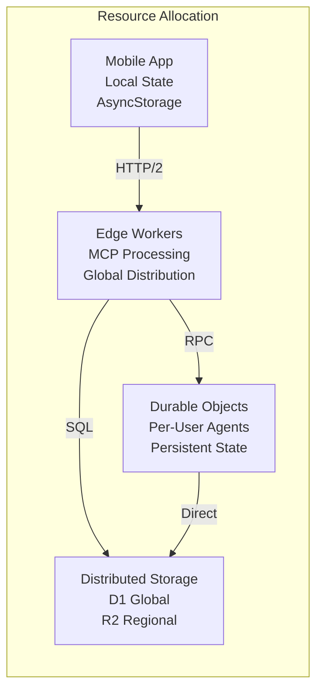

## Future Architecture Evolution

### Planned Enhancements

1. **Agent Ecosystem Expansion**:
   - TideAgent: Direct flow session management
   - AnalyticsAgent: Pattern aggregation
   - NotificationAgent: Smart reminders
   - CollaborationAgent: Multi-user sessions

2. **Protocol Enhancement**:
   - WebSocket MCP support for real-time updates
   - Agent-to-agent communication patterns
   - Enhanced prompt system for AI interactions

3. **Performance Optimization**:
   - Edge-optimized mobile builds
   - Advanced caching strategies
   - Predictive data loading

## Performance Optimization Quick Wins

### 🚀 Server Performance Optimizations

#### 1. **Connection Pooling & Caching**

```typescript
// apps/server/src/storage/d1-r2.ts
class D1R2HybridStorage {
  private apiKeyCache = new Map<
    string,
    { context: AuthContext; expires: number }
  >();

  async validateApiKey(apiKey: string) {
    // Cache API key validation for 5 minutes
    const cached = this.apiKeyCache.get(apiKey);
    if (cached && cached.expires > Date.now()) {
      return cached.context;
    }
    // ... existing validation
  }
}
```

#### 2. **Reduce CORS Overhead**

```typescript
// apps/server/src/index.ts - line 334
if (request.method === "OPTIONS") {
  return new Response(null, {
    status: 204, // Changed from 200
    headers: {
      ...CORS_HEADERS,
      "Cache-Control": "max-age=86400", // Cache preflight for 24h
    },
  });
}
```

#### 3. **Parallel Storage Operations**

```typescript
// apps/server/src/tools/tide-core.ts
export async function createTide(args: any, storage: any, authContext: any) {
  // Run D1 insert and R2 upload in parallel
  const [d1Result, r2Result] = await Promise.all([
    storage.createTideInD1(tideData),
    storage.uploadTideToR2(tideId, fullTideData),
  ]);
}
```

#### 4. **Optimize Tool Registration**

```typescript
// apps/server/src/server.ts - line 144
export function createServer(env: Env, authContext?: AuthContext) {
  const server = new McpServer({...});

  // Register tools only once, not per request
  if (!server._toolsRegistered) {
    registerTideTools(server, storage);
    registerAuthHandlers(server, storage);
    // ... other registrations
    server._toolsRegistered = true;
  }
}
```

### ⚡ Agent Performance Optimizations

#### 1. **Service Initialization Optimization**

```typescript
// apps/agents/tide-productivity-agent/agent.ts - line 48
private async initialize(): Promise<void> {
  // Initialize services in parallel instead of sequentially
  const [mcpClient, aiAnalyzer, webSocketManager, preferencesStore] =
    await Promise.all([
      this.initMCPClient(),
      this.initAIAnalyzer(),
      this.initWebSocketManager(),
      this.initPreferencesStore()
    ]);

  // Then initialize handlers that depend on services
  this.initHandlers();
}
```

#### 2. **Response Streaming for Large Data**

```typescript
// apps/agents/tide-productivity-agent/handlers/insights.ts
async handleRequest(request: Request): Promise<Response> {
  if (request.headers.get('accept')?.includes('text/event-stream')) {
    return this.streamResponse(request);
  }
  return this.standardResponse(request);
}

private streamResponse(request: Request): Response {
  const stream = new ReadableStream({
    start(controller) {
      // Send incremental insights as they're calculated
      controller.enqueue('data: {"status": "analyzing"}\n\n');
      // ... progressive analysis
    }
  });

  return new Response(stream, {
    headers: { 'Content-Type': 'text/event-stream' }
  });
}
```

#### 3. **Smart Agent State Persistence**

```typescript
// apps/agents/tide-productivity-agent/agent.ts
export class TideProductivityAgent {
  private lastAnalysis: Map<string, { result: any; timestamp: number }> =
    new Map();

  async analyze(userId: string, tideId: string) {
    const cacheKey = `${userId}:${tideId}`;
    const cached = this.lastAnalysis.get(cacheKey);

    // Return cached analysis if less than 5 minutes old
    if (cached && Date.now() - cached.timestamp < 300000) {
      return cached.result;
    }

    // ... perform analysis
  }
}
```

### 🔧 Infrastructure Optimizations

#### 1. **Environment-Specific Configuration**

```toml
# wrangler.toml
[env.production]
compatibility_flags = ["nodejs_compat"]
limits = { cpu_ms = 100 }  # Reduced from default for faster cold starts

[env.development]
limits = { cpu_ms = 500 }  # Higher limits for development
```

#### 2. **Bundle Size Optimization**

```typescript
// apps/server/src/server.ts
// Lazy load heavy dependencies
export function createServer(env: Env, authContext?: AuthContext) {
  const server = new McpServer({...});

  // Only register AI tools if AI binding exists
  if (env.AI) {
    import('./handlers/ai-tools').then(({ registerAITools }) => {
      registerAITools(server, storage, env);
    });
  }
}
```

#### 3. **Request Deduplication**

```typescript
// apps/server/src/services/apiClient.ts
class RequestCache {
  private pending = new Map<string, Promise<any>>();

  async dedupedRequest(key: string, fn: () => Promise<any>) {
    if (this.pending.has(key)) {
      return this.pending.get(key);
    }

    const promise = fn();
    this.pending.set(key, promise);

    promise.finally(() => this.pending.delete(key));
    return promise;
  }
}
```

### 📊 Monitoring & Metrics

#### 1. **Performance Tracking**

```typescript
// apps/server/src/index.ts
export default {
  fetch: async (request: Request, env: Env, ctx: ExecutionContext) => {
    const start = Date.now();

    try {
      const response = await handle(server)(request, env, ctx);

      // Log performance metrics
      console.log(`Request completed in ${Date.now() - start}ms`);

      return response;
    } catch (error) {
      console.log(`Request failed after ${Date.now() - start}ms`);
      throw error;
    }
  },
};
```

#### 2. **Health Check Optimization**

```typescript
// apps/agents/tide-productivity-agent/agent.ts - line 151
private handleStatusRequest(): Response {
  // Return cached status if requested within last 10 seconds
  if (this.lastStatusCheck && Date.now() - this.lastStatusCheck < 10000) {
    return new Response(JSON.stringify(this.cachedStatus));
  }

  // ... generate fresh status
}
```

### 🎯 Expected Performance Gains

| Optimization              | Server Improvement  | Agent Improvement     |
| ------------------------- | ------------------- | --------------------- |
| API Key Caching           | 50-80ms reduction   | 30-50ms reduction     |
| Parallel Operations       | 100-200ms reduction | 150-300ms reduction   |
| CORS Caching              | 20-40ms reduction   | N/A                   |
| Service Init Optimization | N/A                 | 200-500ms reduction   |
| Response Streaming        | N/A                 | Perceived 2-3x faster |

These optimizations should reduce typical response times from **500-800ms to 200-400ms** for common operations, with agent initialization improving from **1-2 seconds to 300-600ms**.

## Agent Personality & Tone Customization

The Tides agent system provides multiple layers for customizing AI personality, tone, and response style to match user preferences and use cases.

### 🎯 **Customization Architecture**

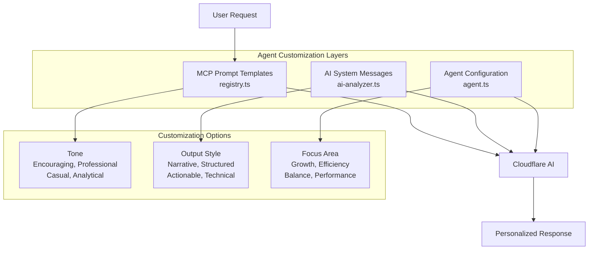

### 🤖 **Method 1: MCP Prompt Template Modification** (Recommended)

The primary customization point is in `/apps/server/src/prompts/registry.ts` where 5 prompt templates control agent behavior:

#### **Available Templates**:

- **`analyze_tide`** - Main productivity analysis (line 50-112)
- **`productivity_insights`** - Pattern recognition (line 127-179)
- **`optimize_energy`** - Energy optimization (line 194-252)
- **`team_insights`** - Team collaboration (line 267-319)
- **`custom_tide_analysis`** - Flexible analysis (line 335-389)

#### **Example: Encouraging Tone Modification**

```typescript
// apps/server/src/prompts/registry.ts - Modify contextTemplate
contextTemplate: `🌊 COMPREHENSIVE TIDE ANALYSIS REQUEST

ANALYSIS STYLE: 
Please respond with an encouraging, growth-focused tone that:
- Celebrates progress and achievements made
- Highlights successful patterns as wins
- Frames optimization opportunities positively
- Uses supportive language and motivation

🌟 PRODUCTIVITY CELEBRATION
   - Acknowledge progress and achievements made
   - Highlight successful patterns and improvements
   - Celebrate consistency and effort

💡 GROWTH OPPORTUNITIES (not problems!)
   - Friendly suggestions for enhancement
   - Gentle optimization recommendations
   - Supportive energy management guidance

🎯 NEXT STEPS FOR SUCCESS
   - Clear, achievable action items
   - Motivation-focused scheduling suggestions
   - Confidence-building workflow improvements

Remember: Every small step forward is progress worth celebrating! 🎉

// ... rest of analysis template
`;
```

#### **Example: Technical/Analytical Tone**

```typescript
contextTemplate: `📊 DATA-DRIVEN TIDE ANALYSIS REQUEST

ANALYSIS APPROACH: 
Provide systematic, metrics-focused analysis with:
- Quantitative performance measurements
- Statistical pattern identification
- Evidence-based recommendations
- Predictive insights where applicable

🔬 QUANTITATIVE PERFORMANCE METRICS
   - Statistical analysis of session effectiveness
   - Correlation coefficients for energy vs productivity
   - Performance benchmarking against optimal baselines

📈 PATTERN RECOGNITION ANALYSIS
   - Algorithmic identification of optimization opportunities
   - Regression analysis of timing vs performance variables
   - Predictive modeling for future performance trends

⚡ OPTIMIZATION ALGORITHMS
   - Mathematical scheduling optimization recommendations
   - Resource allocation efficiency calculations
   - Performance maximization strategies with quantified ROI

// ... rest of analysis template
`;
```

### ⚙️ **Method 2: AI System Message Injection**

Add personality prompts in the AI analyzer service:

```typescript
// apps/agents/tide-productivity-agent/services/ai-analyzer.ts - Line 28
async runAnalysis(messages: any[], model: string = '@cf/meta/llama-3-8b-instruct'): Promise<AnalysisResult> {
  const personalityPrompts = {
    encouraging: `You are a friendly, encouraging productivity coach who:
    - Uses a warm, supportive tone
    - Focuses on actionable insights
    - Celebrates small wins and progress
    - Provides gentle guidance, not criticism
    - Uses emojis sparingly but meaningfully
    - Frames challenges as growth opportunities`,

    professional: `You are a business productivity consultant who:
    - Maintains a professional, structured tone
    - Provides data-driven insights and recommendations
    - Uses clear, business-focused language
    - Emphasizes ROI and efficiency metrics
    - Delivers concise, actionable analysis`,

    analytical: `You are a productivity researcher who:
    - Focuses on patterns, metrics, and systematic optimization
    - Uses precise, technical language
    - Provides evidence-based recommendations
    - Emphasizes statistical significance and trends
    - Delivers comprehensive data analysis`
  };

  const systemPrompt = {
    role: "system",
    content: personalityPrompts.encouraging // configurable
  };

  const aiResponse = await this.aiBinding.run(model, {
    messages: [systemPrompt, ...messages]
  });
}
```

### 🎛️ **Method 3: Agent Configuration System**

Create configurable personality settings:

```typescript
// apps/agents/tide-productivity-agent/agent.ts - Add configuration
export class TideProductivityAgent implements DurableObject {
  private agentPersonality = {
    tone: "encouraging", // 'professional' | 'casual' | 'encouraging' | 'analytical'
    outputStyle: "actionable", // 'detailed' | 'concise' | 'actionable' | 'narrative'
    focusArea: "growth", // 'efficiency' | 'growth' | 'balance' | 'performance'
    language: "simple", // 'technical' | 'simple' | 'business' | 'academic'
    responseFormat: "structured", // 'structured' | 'conversational' | 'bullet_points'
  };

  private getPersonalityPrompt(): string {
    const tonePrompts = {
      encouraging:
        "You are an enthusiastic productivity mentor who celebrates progress and offers gentle guidance.",
      professional:
        "You are a business productivity consultant providing data-driven insights and recommendations.",
      casual:
        "You are a friendly productivity buddy who speaks conversationally and relates to user challenges.",
      analytical:
        "You are a productivity researcher who focuses on patterns, metrics, and systematic optimization.",
    };

    const stylePrompts = {
      actionable: "Focus on specific, implementable recommendations",
      detailed: "Provide comprehensive analysis with thorough explanations",
      concise: "Deliver brief, to-the-point insights",
      narrative: "Tell the story of productivity patterns in flowing prose",
    };

    return `${tonePrompts[this.agentPersonality.tone]} ${stylePrompts[this.agentPersonality.outputStyle]}`;
  }

  // Use in analysis requests
  private async performAnalysis(data: any): Promise<any> {
    const personalizedPrompt = this.getPersonalityPrompt();
    // ... integrate with AI analyzer
  }
}
```

### 🎨 **Personality Configuration Options**

| Aspect              | Available Options                             | Impact                      |
| ------------------- | --------------------------------------------- | --------------------------- |
| **Tone**            | Encouraging, Professional, Casual, Analytical | Overall communication style |
| **Output Style**    | Narrative, Structured, Actionable, Technical  | Response organization       |
| **Focus Area**      | Growth, Efficiency, Balance, Performance      | Analysis emphasis           |
| **Language Level**  | Simple, Business, Technical, Academic         | Vocabulary and complexity   |
| **Response Format** | Structured, Conversational, Bullet Points     | Visual presentation         |

### 🚀 **Quick Implementation Examples**

#### **Casual, Motivational Agent**

```typescript
// Modify prompt template for casual tone
contextTemplate: `Hey there! 👋 Let's dive into your productivity patterns!

I'm excited to help you understand how you're doing and find some awesome ways to level up your workflow. 

🎯 What we're looking at:
- Your flow sessions and how they're going
- Energy patterns (because we all have those ups and downs!)
- Cool optimization opportunities I've spotted

Let's celebrate what's working and brainstorm some fun improvements! ✨`;
```

#### **Executive-Level Professional Agent**

```typescript
contextTemplate: `EXECUTIVE PRODUCTIVITY ANALYSIS

Objective: Comprehensive performance assessment and strategic optimization recommendations.

Key Performance Indicators:
- Operational efficiency metrics and benchmarks
- Resource utilization analysis
- Strategic time allocation assessment
- ROI-focused improvement opportunities

Deliverables:
- Executive summary with actionable insights
- Performance trend analysis with projections
- Strategic recommendations with implementation timeline
- Risk assessment and mitigation strategies`;
```

#### **Data Scientist Agent**

```typescript
contextTemplate: `STATISTICAL PRODUCTIVITY ANALYSIS

Dataset: {{totalSessions}} flow sessions, {{energyDataPoints}} energy measurements
Analysis Period: {{dateRange}}
Confidence Interval: 95%

Methodology:
- Descriptive statistics and distribution analysis
- Correlation analysis (Pearson coefficient calculation)
- Time series trend identification
- Regression modeling for predictive insights

Statistical Findings:
- Session duration: μ={{averageDuration}}min, σ={{standardDeviation}}
- Energy correlation: r={{energyCorrelation}}
- Performance variance: {{performanceVariance}}%

Recommendations based on statistical significance (p<0.05)`;
```

### 📊 **Implementation Priority**

1. **Start with Method 1** (Prompt Templates) - Easiest to implement, affects all interactions
2. **Add Method 2** (System Messages) - Fine-tune specific analysis types
3. **Implement Method 3** (Configuration) - Enable runtime personality switching

This layered approach allows for both broad personality changes and fine-grained customization based on user preferences and use cases.

## Key Orchestration Files

The Tides ecosystem's inter-app relationships are managed by several critical orchestration files that handle routing, communication, and coordination between the mobile client, MCP server, and productivity agents.

### 🎯 **Primary Orchestrators**

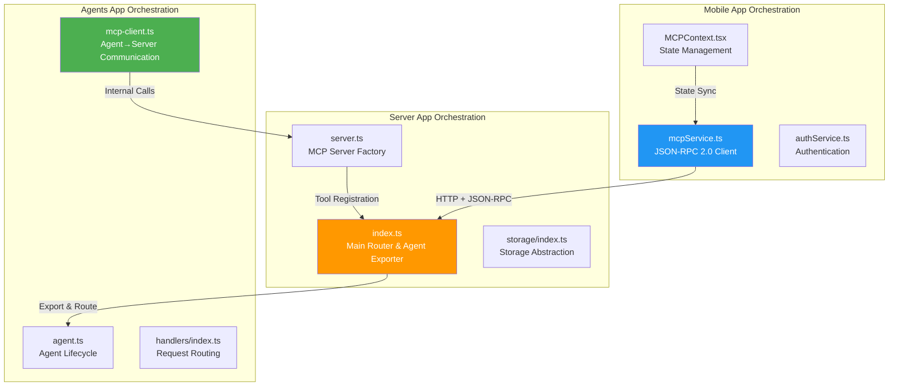

### 📂 **Critical Orchestration Files**

#### **1. Server Router & Agent Exporter**
**File**: `apps/server/src/index.ts` (506 lines)
**Role**: **Primary orchestrator** - Routes all requests and exports agents

```typescript
// Key responsibilities:
export { HelloAgent } from "../../agents/hello/index";
export { TideProductivityAgent } from "../../agents/tide-productivity-agent/index";

// Route delegation patterns:
- /agents/* → handleAgentRequest() → Durable Objects
- /ai/* → handleAIRequest() → AI services  
- /mcp → handle(server) → MCP protocol
- /register-api-key → registerApiKey() → Auth
```

**Critical Lines:**
- **Line 13-14**: Agent class exports for Cloudflare Workers
- **Line 388-392**: Agent routing logic
- **Line 466-471**: MCP server integration
- **Line 328-506**: Main fetch handler orchestrating all apps

#### **2. MCP Server Factory**
**File**: `apps/server/src/server.ts` (158 lines)
**Role**: Creates and configures MCP server with tool registration

```typescript
// Key function - server orchestration
export function createServer(env: Env, authContext?: AuthContext) {
  const server = new McpServer({
    title: "Tides",
    name: packageJson.name,
    version: packageJson.version,
  });

  const storage = createStorage(env);
  
  // Register all tool categories
  registerTideTools(server, storage);
  registerAuthHandlers(server, storage);
  registerPromptHandlers(server, storage, authContext);
  registerExampleHandlers(server);
  
  // Conditional AI tools
  if (env.AI) {
    registerAITools(server, storage, env);
  }

  return server;
}
```

#### **3. Mobile MCP Client Service**
**File**: `apps/mobile/src/services/mcpService.ts` (172 lines)
**Role**: Mobile app's primary interface to server

```typescript
class MCPService {
  private requestId = 0;
  private baseUrl = '';

  // Core communication method
  private async request(method: string, params?: any) {
    const body: MCPRequest = {
      jsonrpc: '2.0',
      id: ++this.requestId,
      method,
      params
    };

    const response = await fetch(`${this.baseUrl}/mcp`, {
      method: 'POST',
      headers: {
        'Content-Type': 'application/json',
        'Accept': 'application/json, text/event-stream',
        'Authorization': `Bearer ${apiKey}`
      },
      body: JSON.stringify(body)
    });
  }

  // 8 tide management tools
  tool(name: string, args?: any) {
    return this.request('tools/call', { name, arguments: args || {} });
  }
}
```

#### **4. Mobile State Orchestrator**
**File**: `apps/mobile/src/context/MCPContext.tsx` (728 lines)  
**Role**: Manages mobile app state and MCP communication

```typescript
export function MCPProvider({ children }: MCPProviderProps) {
  const { user, apiKey } = useAuth();
  const { getCurrentServerUrl: getEnvironmentServerUrl, currentEnvironment } = useServerEnvironment();
  const [state, dispatch] = useReducer(mcpReducer, initialMCPState);

  // Key orchestration functions:
  const createTide = useCallback(async (name, description, flowType) => {
    const response = await mcpService.createTide(name, description, flowType);
    if (response.success && response.tide_id) {
      const newTide: Tide = { /* ... */ };
      dispatch({ type: "ADD_TIDE", payload: newTide });
    }
  }, []);

  // Environment change handling
  useEffect(() => {
    const handleEnvironmentChange = async () => {
      const newServerUrl = getEnvironmentServerUrl();
      await authService.setWorkerUrl(newServerUrl);
      await mcpService.updateServerUrl(newServerUrl);
      dispatch({ type: "RESET_CONNECTION" });
    };
    
    handleEnvironmentChange();
  }, [currentEnvironment, getEnvironmentServerUrl]);
}
```

#### **5. Agent MCP Client** 
**File**: `apps/agents/tide-productivity-agent/services/mcp-client.ts` (190 lines)
**Role**: Agent's interface back to MCP server for data access

```typescript
export class MCPClient {
  private userContext: UserContext;

  async callTool(toolName: string, args: any): Promise<MCPResponse> {
    const mcpRequest = {
      jsonrpc: "2.0",
      id: Date.now(),
      method: "tools/call",
      params: { name: toolName, arguments: args }
    };

    const endpoint = this.getMCPEndpoint();
    const response = await fetch(endpoint, {
      method: 'POST',
      headers: {
        'Content-Type': 'application/json',
        'Authorization': this.getAuthHeader()
      },
      body: JSON.stringify(mcpRequest)
    });
  }

  private getMCPEndpoint(): string {
    const envMap = {
      'production': 'https://tides-001.mpazbot.workers.dev/mcp',
      'staging': 'https://tides-002.mpazbot.workers.dev/mcp', 
      'development': 'https://tides-003.mpazbot.workers.dev/mcp'
    };
    return envMap[this.userContext.environment] || envMap.development;
  }
}
```

### 🔄 **Inter-App Communication Patterns**

#### **Request Flow Orchestration**

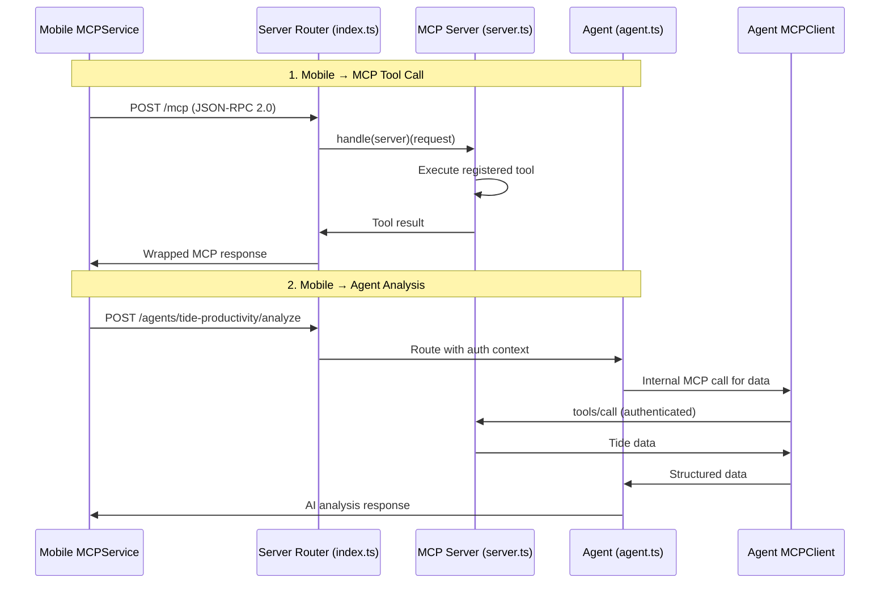

#### **Authentication Flow Orchestration**

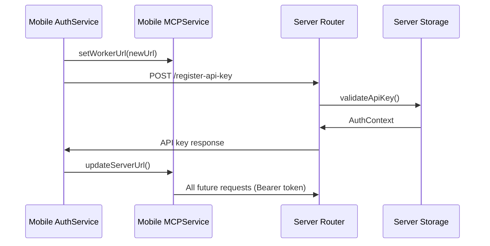

### 🏗️ **Orchestration Responsibilities**

| File | Primary Role | Key Functions | Inter-App Impact |
|------|--------------|---------------|------------------|
| **`server/index.ts`** | **Main Router** | Agent exports, request routing, CORS | Connects all 3 apps |
| **`server/server.ts`** | **MCP Factory** | Tool registration, server creation | Defines available functionality |
| **`mobile/mcpService.ts`** | **Client Interface** | JSON-RPC communication, response parsing | Mobile's gateway to server |
| **`mobile/MCPContext.tsx`** | **State Manager** | React state, environment switching | Coordinates mobile app state |
| **`agents/mcp-client.ts`** | **Agent Interface** | Internal tool calls, environment routing | Agent's data access layer |

### 🎯 **Modification Impact Analysis**

#### **High Impact Changes** (Affect All Apps)
- **`server/index.ts` routing logic** → Breaks mobile/agent communication
- **MCP protocol changes** → Requires updates in mobile + agents
- **Authentication flow** → Affects all inter-app communication

#### **Medium Impact Changes** (Affect 2 Apps)
- **Server tool registration** → Mobile loses functionality
- **Agent MCP client changes** → Affects agent ↔ server communication
- **Mobile service layer** → UI loses server connectivity

#### **Low Impact Changes** (Single App)
- **Mobile UI components** → No cross-app effects
- **Agent handler logic** → Server/mobile unaffected
- **Server storage implementation** → Transparent to clients

### 📊 **Performance Bottlenecks**

The orchestration files are critical performance points:

1. **`server/index.ts`** - All requests pass through here (authentication, routing)
2. **`mobile/MCPContext.tsx`** - State updates trigger re-renders across mobile app
3. **Agent initialization** - Service setup blocks request processing
4. **MCP protocol overhead** - JSON-RPC wrapping adds latency

### 🔧 **Development Guidelines**

**When modifying orchestration files:**

1. **Test all 3 apps** - Changes ripple across the ecosystem
2. **Maintain backward compatibility** - Multiple clients may use different versions
3. **Update authentication flows** - Security changes affect all communication
4. **Monitor performance impact** - These files are hot paths for all requests
5. **Document API changes** - Cross-team coordination required

The orchestration files form the **nervous system** of the Tides ecosystem, coordinating all inter-app communication and ensuring the mobile client, MCP server, and productivity agents work together seamlessly.

## Conclusion

The Tides architecture demonstrates a modern, scalable approach to building MCP-enabled applications. The clear separation between **Mobile (client)**, **Server (protocol)**, and **Agents (intelligence)** creates a flexible foundation for productivity workflow management that can evolve with user needs while maintaining performance and type safety.

The hybrid authentication system, modular component architecture, and service-oriented design patterns provide a robust foundation for both current functionality and future feature expansion. With the performance optimizations outlined above, the system can achieve sub-400ms response times for most operations while maintaining its sophisticated feature set.
